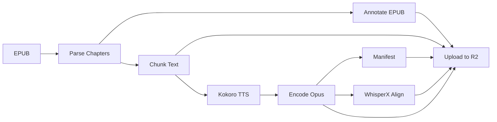

# OpenShelf

Open source public domain audiobook platform. Downloads EPUB books from Project Gutenberg and Standard Ebooks, converts them to AI-narrated audio with word-level text/audio sync, and serves them globally via Cloudflare R2.

## How It Works



An EPUB goes through a seven-step pipeline:

1. **Parse** — extract chapters as structured content elements with stable IDs
2. **Annotate** — inject those IDs back into the EPUB HTML for client-side addressing
3. **Chunk** — split paragraphs into TTS-sized pieces (max 450 words), tracking which paragraphs and element IDs each chunk covers
4. **Synthesize** — generate audio via Kokoro TTS, recording the exact timestamp where each chunk starts
5. **Encode** — convert WAV to Opus at 48kbps
6. **Manifest + Align** — write chapter metadata and run WhisperX forced alignment for word-level timestamps
7. **Upload** — push everything to Cloudflare R2 with immutable cache headers

Every step is idempotent. Re-running skips work that's already done.

## Text/Audio Sync

The platform enables read-along highlighting and seamless switching between reading and listening. Three artifacts on R2 make this work:

| Artifact | Purpose |
|---|---|
| `book.epub` | Annotated EPUB — every content element has a stable `id` (e.g. `ch3-el0012`) |
| `chunks.json` | Maps each TTS chunk to its source element IDs (`el_start`/`el_end`) and paragraph indices |
| `word_alignment.json` | Word-level timestamps from WhisperX, each word tagged with its chunk index |

**Audio -> Text** (highlight while listening):
1. Current playback time -> find word in `word_alignment.json`
2. Word's `chunk_idx` -> look up `el_start`/`el_end` in `chunks.json`
3. Highlight elements by ID in the rendered EPUB

**Text -> Audio** (tap paragraph to seek):
1. Tapped element ID -> find containing chunk in `chunks.json`
2. Chunk index -> first word timestamp in `word_alignment.json`
3. Seek audio player to that time

## R2 Storage Layout

```
books/{author-slug}/{title-slug}/
  book.epub                              # annotated EPUB with element IDs
  chunks.json                            # chunk-to-element mapping (v3)
  audio/{rendition}/
    chapter-01.opus                      # audio files
    chapter-02.opus
    manifest.json                        # chapter metadata, durations
    word_alignment.json                  # word-level timestamps
```

All audio/EPUB/chunk files use `Cache-Control: public, max-age=31536000, immutable`. Manifest uses 60-second cache for prompt updates on reprocessing.

## Prerequisites

- Python 3.11+
- `ffmpeg` with libopus (for Opus encoding)
- GPU recommended for TTS (CUDA or MPS); CPU works but is slow

## Install

```bash
# Install uv
curl -LsSf https://astral.sh/uv/install.sh | sh

# Create venv and install
uv venv
source .venv/bin/activate   # or .venv\Scripts\activate on Windows
uv pip install -r requirements.txt
```

## Quick Start

### Download Books

```bash
# Preview
python3 scripts/download-books.py --dry-run --author "Dostoevsky"

# Download from all sources
python3 scripts/download-books.py --author "Dostoevsky"

# Specific source
python3 scripts/download-books.py --source gutenberg --author "Kafka"
```

Downloads go to `download/books/{source}/{author-slug}/{title-slug}.epub`.

### Convert to Audio

```bash
# Convert (auto-detects GPU)
python3 scripts/convert-book.py path/to/book.epub

# Preview chapters only
python3 scripts/convert-book.py path/to/book.epub --dry-run

# Convert and upload to R2
python3 scripts/convert-book.py path/to/book.epub --upload

# Choose voice and device
python3 scripts/convert-book.py path/to/book.epub --voice bf_emma --device cpu
```

Output goes to `audio/{author-slug}/{title-slug}/{rendition}/`.

### Upload Pre-Generated Audio

```bash
python3 scripts/upload-books.py path/to/book.epub
```

### CLI Options

| Flag | convert-book | upload-books | Description |
|---|---|---|---|
| `epub` | required | required | Path to source EPUB |
| `--output` | `audio/` | `audio/` | Output directory |
| `--source` | `gutenberg` | `gutenberg` | Book source |
| `--rendition` | `kokoro-af-heart` | `kokoro-af-heart` | Rendition name |
| `--voice` | `af_heart` | — | Kokoro voice ID |
| `--device` | auto | — | cuda / mps / cpu |
| `--dry-run` | off | — | Parse only, no audio |
| `--keep-wav` | off | — | Keep intermediate WAVs |
| `--upload` | off | — | Upload to R2 |

## Run Tests

```bash
python3 -m unittest discover -s tests -v
```

All tests are fully mocked — no network, no GPU, no ffmpeg required.

## Configuration

All constants live in `src/openshelf/config.py`:

| Constant | Value | Description |
|---|---|---|
| `TTS_VOICE` | `af_heart` | Kokoro voice ID |
| `TTS_LANGUAGE` | `a` | Kokoro lang code (a=American, b=British) |
| `TTS_SAMPLE_RATE` | `24000` | Sample rate in Hz |
| `CHUNK_MAX_WORDS` | `450` | Max words per TTS chunk |
| `SILENCE_BETWEEN_CHUNKS_MS` | `400` | Silence gap between chunks |
| `OPUS_BITRATE` | `48k` | Opus encoding bitrate |
| `R2_BUCKET` | `openshelf` | R2 bucket name (env override) |
| `R2_DEFAULT_RENDITION` | `kokoro-af-heart` | Default rendition name |
