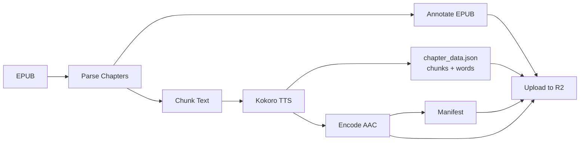

# OpenShelf

Open source public domain audiobook platform. Downloads EPUB books from Project Gutenberg and Standard Ebooks, converts them to AI-narrated audio with word-level text/audio sync, and serves them globally via Cloudflare R2.

## How It Works



An EPUB goes through this pipeline:

1. **Parse** — extract chapters as structured content elements with stable IDs
2. **Annotate** — inject those IDs back into the EPUB HTML for client-side addressing
3. **Chunk** — split paragraphs into TTS-sized pieces (max 450 words), tracking which paragraphs and element IDs each chunk covers
4. **Synthesize** — generate audio via Kokoro TTS, capturing per-word start/end timestamps directly from Kokoro's token output
5. **Encode** — convert WAV to AAC at 48kbps (.m4a)
6. **Manifest + chapter_data** — write a book manifest pointer, a per-build rendition manifest, and `chapter_data.json` (chunk text + inline word timestamps)
7. **Upload** — push everything to Cloudflare R2 with immutable cache headers

Each conversion run mints a fresh 16-hex build ID. Per-build files are immutable;
the book manifest is the short-cached pointer to the current build.

## Text/Audio Sync

The platform enables read-along highlighting and seamless switching between reading and listening. Two artifacts on R2 make this work:

| Artifact | Purpose |
|---|---|
| `book.epub` | Annotated EPUB — every content element has a stable `id` (e.g. `ch3-el0012`) |
| `chapter_data.json` | Per chapter: chunk text + Kokoro word timestamps (start/end) keyed by chunk index |

**Audio -> Text** (highlight while listening):
1. Current playback time -> find word in `chapter_data.json` `words[]`
2. Word's `chunk_idx` -> resolve to chunk text (and, in the EPUB, to the element IDs that chunk covers)
3. Highlight the active word and chunk in the rendered text

**Text -> Audio** (tap word/paragraph to seek):
1. Tapped word -> look up `start` time in `chapter_data.json`
2. Seek audio player to that time

WhisperX forced alignment is no longer published as a public artifact. Kokoro provides timestamps natively in `chapter_data.json`. WhisperX remains in-tree as internal QA tooling used by `test-audio-quality.py` for roundtrip ASR/WER validation.

## R2 Storage Layout

```
books/{author-slug}/{title-slug}/
  book.epub                                # annotated EPUB with element IDs
  cover.{jpg|png}                          # cover image
  manifest.json                            # book-level mutable pointer
  audio/{rendition}/
    builds/{build}/
      chapter-01.m4a                       # audio files
      chapter-02.m4a
      chapter_data.json                    # per-chunk text + Kokoro word timestamps
      rendition-manifest.json              # chapter metadata, durations
```

Build-scoped audio, chapter_data, and rendition manifests use `Cache-Control: public, max-age=31536000, immutable`. The book manifest and catalog use a short cache so clients discover new builds promptly.

## Prerequisites

- Python 3.11+
- `ffmpeg` (for AAC encoding)
- GPU recommended for TTS (CUDA or MPS); CPU works but is slow

## Install

```bash
# Install uv
curl -LsSf https://astral.sh/uv/install.sh | sh

# Create venv and install
uv venv
source .venv/bin/activate   # or .venv\Scripts\activate on Windows
uv pip install -r requirements.txt
```

## Quick Start

### Download Books

```bash
# Preview
python3 scripts/download-books.py --dry-run --author "Dostoevsky"

# Download from all sources
python3 scripts/download-books.py --author "Dostoevsky"

# Specific source
python3 scripts/download-books.py --source gutenberg --author "Kafka"
```

Downloads go to `download/books/{source}/{author-slug}/{title-slug}.epub`.

### Convert to Audio

```bash
# Convert (auto-detects GPU)
python3 scripts/convert-book.py path/to/book.epub

# Preview chapters only
python3 scripts/convert-book.py path/to/book.epub --dry-run

# Convert and upload to R2
python3 scripts/convert-book.py path/to/book.epub --upload

# Choose voice and device
python3 scripts/convert-book.py path/to/book.epub --voice bf_emma --device cpu
```

Output goes to `audio/{author-slug}/{title-slug}/audio/{rendition}/builds/{build}/`.

### CLI Options

| Flag | convert-book | Description |
|---|---|---|
| `epub` | required | Path to source EPUB |
| `--output` | `audio/` | Output directory |
| `--source` | `gutenberg` | Book source |
| `--rendition` | `kokoro-af-heart` | Rendition name |
| `--voice` | `af_heart` | Kokoro voice ID |
| `--device` | auto | cuda / mps / cpu |
| `--dry-run` | off | Parse only, no audio |
| `--keep-wav` | off | Keep intermediate WAVs |
| `--upload` | off | Upload to R2 |

## Run Tests

```bash
python3 -m unittest discover -s tests -v
```

All tests are fully mocked — no network, no GPU, no ffmpeg required.

## Configuration

All constants live in `src/openshelf/config.py`:

| Constant | Value | Description |
|---|---|---|
| `TTS_VOICE` | `af_heart` | Kokoro voice ID |
| `TTS_LANGUAGE` | `a` | Kokoro lang code (a=American, b=British) |
| `TTS_SAMPLE_RATE` | `24000` | Sample rate in Hz |
| `CHUNK_MAX_WORDS` | `450` | Max words per TTS chunk |
| `SILENCE_BETWEEN_CHUNKS_MS` | `400` | Silence gap between chunks |
| `AAC_BITRATE` | `48k` | AAC encoding bitrate |
| `R2_BUCKET` | `openshelf` | R2 bucket name (env override) |
| `R2_DEFAULT_RENDITION` | `kokoro-af-heart` | Default rendition name |
