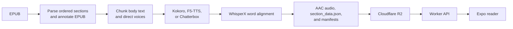

# OpenShelf

OpenShelf is an open source public domain audiobook platform. Its Python pipeline downloads EPUBs from Project Gutenberg and Standard Ebooks, generates audio with a choice of TTS engines, aligns the final audio to words with WhisperX, and publishes the results to Cloudflare R2. A Cloudflare Worker serves the catalog and book data to an Expo reader.

## Current Capabilities

- The client searches the **published audiobook catalog** by title or author, browses books and retained rendition builds, streams audio, highlights the current word, and seeks when a word is tapped.
- The Python CLI searches and downloads source EPUBs, generates audiobooks locally, resumes a specified build, and uploads completed builds to R2.
- A first Gutenberg-only generation slice is implemented: bounded typo-tolerant source suggestions, owner-protected job requests, D1 job leases, and an outbound PC consumer using Kokoro `af_heart`. Production generation remains disabled until its own D1 and Worker secrets are configured.

The [book discovery and generation job plan](plans/search-and-generation-jobs.md) tracks the wider rollout, including Standard Ebooks and more voices.

## How It Works


```mermaid
flowchart LR
    EPUB --> Parse[Parse ordered sections<br/>and annotate EPUB]
    Parse --> Chunk[Chunk body text<br/>and direct voices]
    Chunk --> TTS[Kokoro, F5-TTS,<br/>or Chatterbox]
    TTS --> Align[WhisperX word alignment]
    Align --> Build[AAC audio, section_data.json,<br/>and manifests]
    Build --> R2[Cloudflare R2]
    R2 --> Worker[Worker API]
    Worker --> Client[Expo reader]
```

The parser keeps each section's heading separate from its body and follows EPUB spine order for playback. Opening and closing credits are generated sections. The default cast mode uses one narrator throughout the book; experimental multicast is opt-in. Each conversion creates a fresh 16-hex build ID unless a specific build is supplied for resume. A rendition identifies the engine and narrator voice; a build identifies one immutable set of output files. The book manifest points to the current build of each rendition.

### Text and Audio Sync

Version-2 `section_data.json` contains every section's display and spoken heading, body chunks, and WhisperX word timestamps. Heading and body words are separate alignment regions. The Worker returns one section with flattened words tagged as `heading` or `body`; body words include a chunk index. The client reads playback time for highlighting and seeks to a word's start time when tapped. It pins the selected rendition and build while reading so audio and text come from the same generation run.

### R2 Layout

```text
catalog.json
books/{author-slug}/{title-slug}/
  book.epub                         # annotated EPUB
  cover.{jpg|png}
  manifest.json                     # mutable current-build pointer
  audio/{rendition}/builds/{build}/
    section-01.m4a                  # one audio file per section
    section-01.synthesis_units.json # synthesis seam audit
    section_data.json               # headings, body chunks, word timings
    character_registry.json         # narrator and character voice metadata
    voice_direction.json            # speaker and performance audit
    run.json                        # resume context
    rendition-manifest.json         # ordered sections; uploaded last
```

Build files use immutable cache headers. The book manifest and catalog use a short cache; the rendition manifest signals that a complete build has been uploaded. Audit files and `run.json` are uploaded when present.

### Worker API

Under `/api/v1`, the Worker serves `GET /catalog`, `/books/:author/:title`, `/books/:author/:title/builds`, `/books/:author/:title/sections/:sequence`, `/books/:author/:title/sections/:sequence/audio`, and book cover and EPUB routes. Section and audio requests identify a rendition and build. The catalog contains already-published audiobooks and its `q` search is a case-insensitive title/author substring filter. The API contract is generated from route schemas at `/api/v1/openapi.json`, with interactive docs at `/api/v1/docs`.

The additive job API has `GET /source-books` suggestions, owner-authenticated
job create/status/retry routes, and PC-only source sync, claim, heartbeat,
progress, and finish routes. D1 stores the source index and leases. The Worker
checks the R2 book pointer, section objects, and catalog before completion.
Rate-limit bindings protect public search and authentication attempts; D1 caps
queued jobs, daily starts, and job attempts. Generation stays owner-only.

## Development

Prerequisites: Node.js, Python 3.11+, `uv`, and `ffmpeg`. A CUDA or MPS GPU is recommended for generation; CPU synthesis is slow. From the repository root:

```bash
npm install
npm run dev:window       # local Worker and Expo client; Windows-safe
npm run dev:window:r2    # local client and Worker with remote R2
npm run test             # Worker and client tests
npm run typecheck        # Worker and client TypeScript checks
cd client; npm run test:e2e  # headless browser flow (Edge locally, Chromium in CI)
```

The remote-R2 development command requires Wrangler login; the local command
uses simulated R2 storage.

For the Python pipeline, create and activate a **root** `.venv`, then run the setup script. It installs `pipeline/requirements.txt`, selects a compatible PyTorch wheel, and verifies the device:

```powershell
uv venv
.\.venv\Scripts\Activate.ps1
python scripts/setup-pipeline.py
python scripts/setup-pipeline.py --verify
```

On macOS/Linux, activate with `source .venv/bin/activate` instead. The Python tests run from the repository root with `python -m unittest discover -s pipeline/tests -v`.

### Download and Generate

The source-tree CLI entry point is `python pipeline/scripts/openshelf-pipeline.py`. These examples run from the repository root with the pipeline environment active:

```bash
# Preview a Gutenberg download search.
python pipeline/scripts/openshelf-pipeline.py books download --source gutenberg --author "Kafka" --dry-run

# Download books from both supported sources.
python pipeline/scripts/openshelf-pipeline.py books download --author "Dostoevsky"

# Process a local EPUB using the default Kokoro engine.
python pipeline/scripts/openshelf-pipeline.py books process --epub path/to/book.epub

# Choose an engine, voice, and device, then publish to R2.
python pipeline/scripts/openshelf-pipeline.py books process --epub path/to/book.epub --engine kokoro --voice bf_emma --device cuda --upload

# Resume the same build after an interrupted run.
python pipeline/scripts/openshelf-pipeline.py books process --epub path/to/book.epub --engine kokoro --voice bf_emma --build-id 2a4f9c1b3d8e7f60 --resume --upload
```

Downloads go to `download/books/{source}/{author-slug}/{title-slug}.epub`. Local output goes to `audio/{author-slug}/{title-slug}/audio/{rendition}/builds/{build}/`. The `books process` command can also search and download using `--author` or `--book` instead of `--epub`. `--dry-run` parses and chunks without synthesis; `--sections` selects playback sequences. Resuming a build checks its `run.json` against the EPUB and immutable settings. For stage-level repair and explicit artifact paths, see [Pipeline DAG CLI](pipeline/docs/dag-cli.md).

Voice direction uses the configured LLM provider (`LLM_PROVIDER`, with provider credentials such as `ANTHROPIC_API_KEY` or `OPENAI_API_KEY`). Uploads use `R2_ACCOUNT_ID`, `R2_ACCESS_KEY`, `R2_SECRET_KEY`, and optional `R2_BUCKET`. Defaults and audio settings live in `pipeline/src/openshelf/config.py`.

### Owner generation jobs

The first generation path accepts exact Project Gutenberg IDs and uses Kokoro
`af_heart`. The PC pulls work over outbound HTTPS; no inbound port is needed.
Production uses `openshelf-jobs` D1 and the `openshelf` R2 bucket. Staging uses
isolated `openshelf-jobs-staging` D1 and `openshelf-staging` R2 resources. Both
Workers have distinct owner and PC credentials, and the production source index
has its first 64 Gutenberg editions.

On this PC, the two locally generated tokens are in the ignored
`worker/.secrets/` directory. The **owner token** is entered in the client only
when creating or retrying a job; the **PC token** stays on the PC. To run the
staging path from the repository root in PowerShell:

```powershell
$env:EXPO_PUBLIC_API_BASE = 'https://openshelf-api-staging.johnkoeh.workers.dev/api/v1'
npm --prefix client run web
# In a separate terminal, after the owner submits a job:
$env:OPENSHELF_PC_TOKEN = (Get-Content worker/.secrets/pc-token -Raw).Trim()
$env:R2_BUCKET = 'openshelf-staging'
.\.venv\Scripts\python.exe pipeline/scripts/openshelf-pipeline.py books consume-jobs --api-base https://openshelf-api-staging.johnkoeh.workers.dev/api/v1 --sync-pages 2
```

Copy the owner token from `worker/.secrets/owner-token` into the client's token
field. For production, use `worker/.secrets/prod-owner-token` in the client,
`worker/.secrets/prod-pc-token` as `OPENSHELF_PC_TOKEN` on the PC, the
`https://openshelf-api.johnkoeh.workers.dev/api/v1` API base, and
`R2_BUCKET=openshelf`. Keep these environment credentials separate.
Source sync can cover more Gutendex pages with `--sync-pages N` (up to
3000); the already indexed 64 popular editions include Gutenberg #11. The PC
must have its pipeline dependencies, GPU, ffmpeg, and R2 upload credentials.
Use `--once` to claim at most one job. The Worker caps generation at two starts
per UTC day, three queued jobs, and three attempts per job; a search request is
limited to 60 per minute per client IP. Worker rate limits reduce D1 work, but
a large bot flood can still invoke the Worker on `workers.dev`. A custom-domain
WAF rule can reject such traffic before invocation if this becomes public at
larger scale.

Offline API, PC, and headless browser checks run in `.github/workflows/verify.yml`.
The staging acceptance run covered index sync, autocomplete, protected creation,
PC claim, GPU synthesis and alignment, R2 publication, job completion, search
availability, section data, and ranged audio for *The Tale of Peter Rabbit*
(Gutenberg #14838, 6.0 minutes). The browser automation covers the client flow
against a mocked API; the live run used the Worker and PC CLI.

## Deployment

OpenShelf has two production surfaces, deployed by Cloudflare's Git integration after merges to the configured production branch.

### Worker API

- Cloudflare Worker: `openshelf-api`
- Repo: `jkoeh/openshelf`
- Root directory: `worker`
- Production branch: `main`
- Install/build command: `npm ci`
- Deploy command: `npm run deploy:production`

The production Worker reads `worker/wrangler.toml`, where `[env.production]` deploys `openshelf-api` with the `openshelf` R2 bucket binding.

### Web Client

- Cloudflare Pages project: `openshelf`
- Repo: `jkoeh/openshelf`
- Root directory: `client`
- Production branch: `main`
- Build command: `npm run build:web`
- Output directory: `dist`
- Environment variable: `EXPO_PUBLIC_API_BASE=https://openshelf-api.johnkoeh.workers.dev/api/v1`

```bash
cd client
EXPO_PUBLIC_API_BASE=https://openshelf-api.johnkoeh.workers.dev/api/v1 npm run build:web
npx wrangler pages deploy dist --project-name openshelf --branch main
```

The client includes `public/_redirects` so Cloudflare Pages serves Expo Router deep links through `index.html`.
