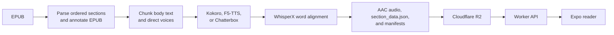

# OpenShelf

OpenShelf is an open source public domain audiobook platform. Its Python pipeline downloads EPUBs from Project Gutenberg and Standard Ebooks, generates audio with a choice of TTS engines, aligns the final audio to words with WhisperX, and publishes the results to Cloudflare R2. A Cloudflare Worker serves the catalog and book data to an Expo reader.

## Current Capabilities

- The client searches the **published audiobook catalog** by title or author, browses books and retained rendition builds, streams audio, highlights the current word, and seeks when a word is tapped.
- The Python CLI searches and downloads source EPUBs, generates audiobooks locally, resumes a specified build, and uploads completed builds to R2.
- The Gutenberg generation flow has bounded typo-tolerant source suggestions, D1 job leases, and an outbound PC consumer. Visitors can request fixed Kokoro `af_heart`; the owner can request fixed Chatterbox `af_heart` with OpenAI emotion direction.

The [book discovery and generation job plan](plans/search-and-generation-jobs.md) tracks the wider rollout, including Standard Ebooks and more voices.

## How It Works


```mermaid
flowchart LR
    EPUB --> Parse[Parse ordered sections<br/>and annotate EPUB]
    Parse --> Chunk[Chunk body text<br/>and direct voices]
    Chunk --> TTS[Kokoro, F5-TTS,<br/>or Chatterbox]
    TTS --> Align[WhisperX word alignment]
    Align --> Build[AAC audio, section_data.json,<br/>and manifests]
    Build --> R2[Cloudflare R2]
    R2 --> Worker[Worker API]
    Worker --> Client[Expo reader]
```

The parser keeps each section's heading separate from its body and follows EPUB spine order for playback. Opening and closing credits are generated sections. The default cast mode uses one narrator throughout the book; experimental multicast is opt-in. Each conversion creates a fresh 16-hex build ID unless a specific build is supplied for resume. A rendition identifies the engine and narrator voice; a build identifies one immutable set of output files. The book manifest points to the current build of each rendition.

### Text and Audio Sync

Version-2 `section_data.json` contains every section's display and spoken heading, body chunks, and WhisperX word timestamps. Heading and body words are separate alignment regions. The Worker returns one section with flattened words tagged as `heading` or `body`; body words include a chunk index. The client reads playback time for highlighting and seeks to a word's start time when tapped. It pins the selected rendition and build while reading so audio and text come from the same generation run.

### R2 Layout

```text
catalog.json
books/{author-slug}/{title-slug}/
  book.epub                         # annotated EPUB
  cover.{jpg|png}
  manifest.json                     # mutable current-build pointer
  audio/{rendition}/builds/{build}/
    section-01.m4a                  # one audio file per section
    section-01.synthesis_units.json # synthesis seam audit
    section_data.json               # headings, body chunks, word timings
    character_registry.json         # narrator and character voice metadata
    voice_direction.json            # speaker and performance audit
    run.json                        # resume context
    rendition-manifest.json         # ordered sections; uploaded last
```

Build files use immutable cache headers. The book manifest and catalog use a short cache; the rendition manifest signals that a complete build has been uploaded. Audit files and `run.json` are uploaded when present.

### Worker API

Under `/api/v1`, the Worker serves `GET /catalog`, `/books/:author/:title`, `/books/:author/:title/builds`, `/books/:author/:title/sections/:sequence`, `/books/:author/:title/sections/:sequence/audio`, and book cover and EPUB routes. Section and audio requests identify a rendition and build. The catalog contains already-published audiobooks and its `q` search is a case-insensitive title/author substring filter. The API contract is generated from route schemas at `/api/v1/openapi.json`, with interactive docs at `/api/v1/docs`.

The additive job API has public `GET /source-books` suggestions, capped public
job creation and status reads, owner-authenticated cancel/retry/regeneration
and expressive requests,
and PC-only source sync, claim, heartbeat, progress, and finish routes. D1 stores the source index and leases. The Worker
checks the R2 book pointer, section objects, and catalog before completion.
Rate-limit bindings protect public search and authentication attempts. A bounded
15-second cache within each Worker instance can save D1 reads for repeated
suggestions after rate limiting; it is best effort because instances do not
share memory. Clients receive `no-store` and may see job availability lag by up
to 15 seconds. D1 caps queued jobs, daily starts, and job attempts. Generation
is public for the fixed Kokoro voice; once configured, Google sign-in for
`johnkoeh@gmail.com` allows browser cancel, retry, regeneration, and expressive
requests. The expressive job uses Chatterbox `af_heart` and batched OpenAI
emotion direction on the PC. It has no public API option for arbitrary prompts,
models, or voices, and both modes share the same daily and queue caps. The local
owner token remains available for CLI administration.
The browser verifies sign-in through `GET /api/v1/admin/me` before showing
admin controls; it keeps the Google ID token in memory only. Owner controls
opens a responsive modal with Google sign-in, loading/error feedback, and
sign-out. Successful sign-in closes the modal and enables job actions in search.

## Development

Prerequisites: Node.js, Python 3.11+, `uv`, and `ffmpeg`. A CUDA or MPS GPU is recommended for generation; CPU synthesis is slow. From the repository root:

```bash
npm install
npm run dev:window       # local Worker and Expo client; Windows-safe
npm run dev:window:r2    # local client and Worker with remote R2
npm run test             # Worker and client tests
npm run typecheck        # Worker and client TypeScript checks
cd client; npm run test:e2e  # headless browser flow (Edge locally, Chromium in CI)
```

The remote-R2 development command requires Wrangler login; the local command
uses simulated R2 storage.

For the Python pipeline, create and activate a **root** `.venv`, then run the setup script. It installs `pipeline/requirements.txt`, selects a compatible PyTorch wheel, and verifies the device:

```powershell
uv venv
.\.venv\Scripts\Activate.ps1
python scripts/setup-pipeline.py
python scripts/setup-pipeline.py --verify
```

On macOS/Linux, activate with `source .venv/bin/activate` instead. The Python tests run from the repository root with `python -m unittest discover -s pipeline/tests -v`.

### Download and Generate

The source-tree CLI entry point is `python pipeline/scripts/openshelf-pipeline.py`. These examples run from the repository root with the pipeline environment active:

```bash
# Preview a Gutenberg download search.
python pipeline/scripts/openshelf-pipeline.py books download --source gutenberg --author "Kafka" --dry-run

# Download books from both supported sources.
python pipeline/scripts/openshelf-pipeline.py books download --author "Dostoevsky"

# Process a local EPUB using the default Kokoro engine.
python pipeline/scripts/openshelf-pipeline.py books process --epub path/to/book.epub

# Choose an engine, voice, and device, then publish to R2.
python pipeline/scripts/openshelf-pipeline.py books process --epub path/to/book.epub --engine kokoro --voice bf_emma --device cuda --upload

# Resume the same build after an interrupted run.
python pipeline/scripts/openshelf-pipeline.py books process --epub path/to/book.epub --engine kokoro --voice bf_emma --build-id 2a4f9c1b3d8e7f60 --resume --upload
```

Downloads go to `download/books/{source}/{author-slug}/{title-slug}.epub`. Local output goes to `audio/{author-slug}/{title-slug}/audio/{rendition}/builds/{build}/`. The `books process` command can also search and download using `--author` or `--book` instead of `--epub`. `--dry-run` parses and chunks without synthesis; `--sections` selects playback sequences. Resuming a build checks its `run.json` against the EPUB and immutable settings. For stage-level repair and explicit artifact paths, see [Pipeline DAG CLI](pipeline/docs/dag-cli.md).

Voice direction uses the configured LLM provider (`LLM_PROVIDER`, with provider credentials such as `ANTHROPIC_API_KEY` or `OPENAI_API_KEY`). Uploads use `R2_ACCOUNT_ID`, `R2_ACCESS_KEY`, `R2_SECRET_KEY`, and optional `R2_BUCKET`. Defaults and audio settings live in `pipeline/src/openshelf/config.py`.

### Generation jobs

Every indexed search result offers **Read now**. It opens the source EPUB reader
immediately and independently requests audio, or follows an existing job.
An animated owl shows stage milestones above the text until Start Listening is
ready. Text remains available if the PC is offline or generation fails or hits
queue/start limits. Book detail offers Read now; the annotated EPUB API remains available.

Generation accepts exact Project Gutenberg IDs. Public jobs use Kokoro
`af_heart`; owner-only expressive jobs use Chatterbox `af_heart` and OpenAI
emotion direction. The PC pulls work over outbound HTTPS; no inbound port is needed.
Production uses `openshelf-jobs` D1 and the `openshelf` R2 bucket. Staging uses
isolated `openshelf-jobs-staging` D1 and `openshelf-staging` R2 resources. Both
Workers have distinct owner and PC credentials, and the production source index
held 519 Gutenberg editions when checked on September 30, 2026.
The client identifies this as a limited source index; an empty suggestion list
does not mean Gutenberg lacks the book. Visitors can request the fixed Kokoro
voice within the Worker daily and queue caps. Owner retry, regeneration, and
cancellation and expressive requests can use configured browser Google sign-in
for `johnkoeh@gmail.com` or the local owner token. `OPENAI_API_KEY` stays in
`pipeline/.env` or the PC shell; a consumer without it leaves expressive jobs
queued for a capable run. Standard jobs never call OpenAI. To enable
browser sign-in, create a Google OAuth Web client with the production Pages
origins `https://openshelf.johannkoeh.io`, `https://openshelf.pages.dev`, and
your local web origin (including its port) for testing,
set its client ID as the Worker's `GOOGLE_CLIENT_ID` in staging and production,
and set `EXPO_PUBLIC_GOOGLE_CLIENT_ID` for the client build. The client ID is
public; no Google client secret or owner token belongs in the web bundle.
OpenShelf's public OAuth Web client ID is
`121946934713-47vg0jerk474j3jta9tkp52j1ta50sjc.apps.googleusercontent.com`.
The Worker declares it in `wrangler.toml` for local, staging, production, and
remote-R2 development. Pages production and preview builds use the same ID
through `EXPO_PUBLIC_GOOGLE_CLIENT_ID`; local web development can use ignored
`client/.env`. Google authorized JavaScript origins must include each site
origin used for login. Owner access still requires verified `johnkoeh@gmail.com`.
If either ID is absent, browser admin actions stay unavailable.
For the Git-integrated Pages build, add `EXPO_PUBLIC_GOOGLE_CLIENT_ID` to the
Pages project's production and preview build environment variables, then
rebuild the deployment; setting it only in a local shell does not configure
the published site. The Worker and client must use the same Web client ID,
and every origin where sign-in is used must be an authorized JavaScript origin
in that Google OAuth client. Verify the deployed Owner controls modal displays
the Google button and that the owner account passes `/api/v1/admin/me`.
Apply all Worker D1 migrations before deploying the matching Worker; the latest
job lookup index keeps autocomplete bounded as job history grows.

On this PC, the two locally generated tokens are in the ignored
`worker/.secrets/` directory. The **owner token** stays on this PC for local
administration; the **PC token** authenticates the outbound consumer. Neither
is entered into the public client. To run the
staging path from the repository root in PowerShell:

```powershell
$env:EXPO_PUBLIC_API_BASE = 'https://openshelf-api-staging.johnkoeh.workers.dev/api/v1'
npm --prefix client run web
# In a separate terminal, after a visitor submits a job:
$env:OPENSHELF_PC_TOKEN = (Get-Content worker/.secrets/pc-token -Raw).Trim()
$env:R2_BUCKET = 'openshelf-staging'
.\.venv\Scripts\python.exe pipeline/scripts/openshelf-pipeline.py books consume-jobs --api-base https://openshelf-api-staging.johnkoeh.workers.dev/api/v1 --sync-pages 2
```

For production, use `worker/.secrets/prod-pc-token` as `OPENSHELF_PC_TOKEN`
on the PC, the
`https://openshelf-api.johnkoeh.workers.dev/api/v1` API base, and
`R2_BUCKET=openshelf`. Keep these environment credentials separate.

Audio preflight defaults to 100,000 source spoken words. A `BOOK_TOO_LONG`
failure reports the count and limit in the consumer log and remains visible
when reopening source search. After reviewing a longer book, retry as owner
and use `books consume-jobs --api-base URL --max-words N --once` when it is the
only queued job. This deliberate per-invocation override retains the default
budget and all rights checks.

### Windows job monitor

Double-click `scripts/open-job-monitor.cmd` after the root `.venv` is set up.
The native window shows pending, running, expired-lease (stuck), and recent jobs,
the local consumer state, and its log tail. Select a queued job to set high or
normal priority; select a queued/running job and choose **Cancel job** to revoke
its lease. A running PC child stops at its next heartbeat (up to about 30
seconds). The window can start the existing outbound production consumer if it
is not running. Closing the window leaves the consumer running. Owner and PC
tokens are read from ignored files under `worker/.secrets/`, never entered in
the UI. The queue refreshes every 15 seconds; it uses no inbound server.
Deploy the matching additive D1 migration before the Worker update.
CI runs the monitor's offline unit tests alongside the consumer tests.
Source sync can cover a few more Gutendex pages with `--sync-pages N` (up to
10 per run); use the bounded, rights-checked official catalog import below for
broader coverage. The first seed had 64 popular editions, including Gutenberg
#11; the later rights-verified import brought the index to 519. The PC
must have its pipeline dependencies, GPU, ffmpeg, and R2 upload credentials.
For a broader, operator-controlled index, download Gutenberg's weekly
[compressed CSV catalog](https://www.gutenberg.org/ebooks/offline_catalogs.html)
into the ignored `download/` directory, then run:

```powershell
New-Item -ItemType Directory -Force download | Out-Null
curl.exe -fL https://dev.gutenberg.org/cache/epub/feeds/pg_catalog.csv.gz -o download/pg_catalog.csv.gz
curl.exe -fL https://dev.gutenberg.org/cache/epub/feeds/rdf-files.tar.bz2 -o download/rdf-files.tar.bz2
$env:OPENSHELF_PC_TOKEN = (Get-Content worker/.secrets/prod-pc-token -Raw).Trim()
.\.venv\Scripts\python.exe pipeline/scripts/openshelf-pipeline.py books sync-catalog --catalog download/pg_catalog.csv.gz --rights-archive download/rdf-files.tar.bz2 --api-base https://openshelf-api.johnkoeh.workers.dev/api/v1 --max-books 500
```

This imports English text metadata in batches of 50;
it does not claim a job or invoke the GPU. Import checks the official RDF
archive for an explicit US public-domain marker and a matching EPUB URL;
the PC checks official RDF and the downloaded EPUB's own rights notice before
synthesis. Unknown or copyrighted records fail
closed. Gutenberg's marker establishes U.S. public-domain status, not rights in
every country. OpenShelf does not geographically restrict public reading; the
operator remains responsible for distribution rights outside the U.S. Manual
`books process --upload` and `dag run --upload` accept local EPUBs without this
automatic rights check, so verify those editions before publishing.
The 1,000-candidate per-run ceiling
and 500-record default keep each import small. Repeat with `--after-id <last imported Gutenberg ID>`
to cover later ranges only after checking D1's daily row-write usage and the
account plan; the cap applies per run, not per day.
Use `--once` to claim at most one job. The Worker caps generation at two starts
per UTC day, three queued jobs, and three attempts per job; public job creation
is limited to five attempts per minute per client IP and search to 60 per
minute per client IP. Cancellation revokes a running lease and stops the PC
child process on its next 30-second heartbeat; it does not refund a daily start
or delete already uploaded audio. Worker rate limits reduce D1 work, but
a large bot flood can still invoke the Worker on `workers.dev`. A custom-domain
WAF rule can reject such traffic before invocation if this becomes public at
larger scale.
To cancel one queued or running production job from this PC, copy its job ID
from the request status and run:

```powershell
.\worker\scripts\cancel-job.ps1 -JobId '<job UUID>'
```

The script reads the ignored production owner key locally; it never asks for
that key in the public site. Add `-Environment staging` for a staging job.
The PC consumer rejects EPUB archives above 2 MiB ZIP metadata, 256 MiB
expanded size, or 5,000 entries, and books over 100,000 source spoken words
(body plus spoken headings) before starting any LLM or synthesis work.
Use `--max-words N` to deliberately raise or lower that per-job ceiling.

Offline API, PC, and headless browser checks run in `.github/workflows/verify.yml`.
The staging acceptance run covered index sync, autocomplete, protected creation,
PC claim, GPU synthesis and alignment, R2 publication, job completion, search
availability, section data, and ranged audio for *The Tale of Peter Rabbit*
(Gutenberg #14838, 6.0 minutes). The browser automation covers the client flow
against a mocked API; the live run used the Worker and PC CLI.

## Deployment

OpenShelf has two production surfaces, deployed by Cloudflare's Git integration after merges to the configured production branch.

### Worker API

- Cloudflare Worker: `openshelf-api`
- Repo: `jkoeh/openshelf`
- Root directory: `worker`
- Production branch: `main`
- Install/build command: `npm ci`
- Deploy command: `npm run deploy:production`

The production Worker reads `worker/wrangler.toml`, where `[env.production]` deploys `openshelf-api` with the `openshelf` R2 bucket binding.

### Web Client

- Cloudflare Pages project: `openshelf`
- Repo: `jkoeh/openshelf`
- Root directory: `client`
- Production branch: `main`
- Build command: `npm run build:web`
- Output directory: `dist`
- Environment variable: `EXPO_PUBLIC_API_BASE=https://openshelf-api.johnkoeh.workers.dev/api/v1`
- Owner login build variable: `EXPO_PUBLIC_GOOGLE_CLIENT_ID` (the same public
  Google OAuth Web client ID configured as the Worker's `GOOGLE_CLIENT_ID`).

```bash
cd client
EXPO_PUBLIC_API_BASE=https://openshelf-api.johnkoeh.workers.dev/api/v1 npm run build:web
npx wrangler pages deploy dist --project-name openshelf --branch main
```

The client includes `public/_redirects` so Cloudflare Pages serves Expo Router deep links through `index.html`.
