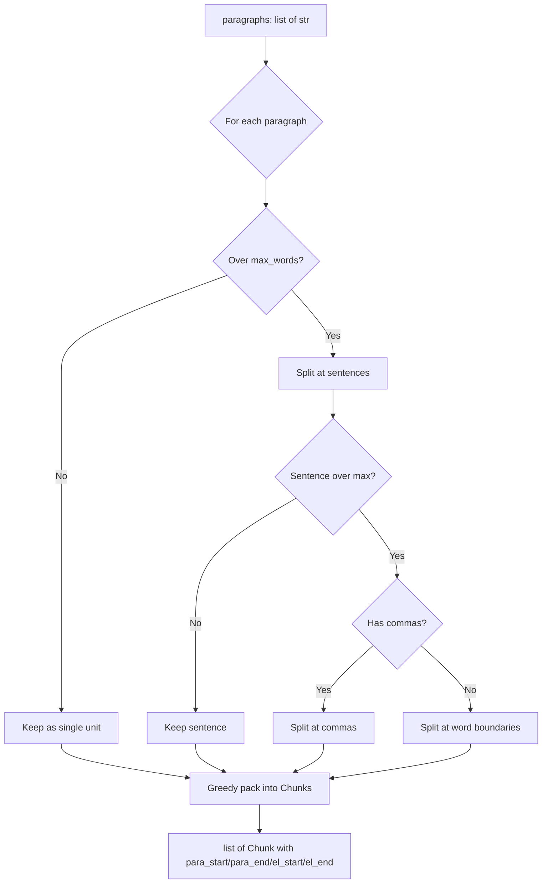

# Step 2: Text Chunker

**Module:** `src/openshelf/pipeline/text_chunker.py`
**Test:** `tests/pipeline/test_text_chunker.py`

## Purpose

Split a chapter's spoken paragraphs into TTS-sized chunks (max 450 words), preserving paragraph boundaries and tracking which source paragraphs and element IDs each chunk covers. This mapping is what enables text/audio sync — given a chunk index, you can find the exact DOM elements it corresponds to.



## Interface

### Dataclass

```python
@dataclass
class Chunk:
    text: str           # chunk text (paragraphs joined with "\n\n")
    para_start: int     # index of first paragraph in Chapter.paragraphs
    para_end: int       # index of last paragraph (inclusive)
    el_start: str = ""  # element ID of first spoken element
    el_end: str = ""    # element ID of last spoken element
```

### Public Functions

```python
def chunk_text(
    paragraphs: list[str],
    max_words: int = CHUNK_MAX_WORDS,       # 450
    element_ids: list[str] | None = None,   # parallel to paragraphs
) -> list[Chunk]

def serialize_chunks(
    chapters: list[dict[str, Any]],  # [{"number", "title", "chunks": list[Chunk]}]
    epub_sha256: str,
) -> str  # JSON string

def deserialize_chunks(json_str: str) -> dict[str, Any]

def sha256_file(path: str) -> str
```

## Behavior

### Chunking Algorithm

1. **Pre-split** oversized paragraphs (> `max_words`) into sub-units at sentence boundaries
2. **Greedy pack** paragraph units into chunks up to `max_words`
3. Multiple short paragraphs can share a chunk; chunks never cross paragraph boundaries within a single pack step

### Sentence Splitting

Splits on `(?<=[.!?])\s+` with abbreviation protection. Known abbreviations (Mr., Dr., etc.) and single uppercase initials (J. K. Rowling) have their periods temporarily replaced to prevent false splits.

### Oversized Handling

If a sentence exceeds `max_words`:
1. Try splitting at `, ` (comma + space)
2. If still oversized, split at word boundaries (hard split every `max_words` words)

### Element ID Tracking

When `element_ids` is provided (parallel list to `paragraphs`), each chunk records `el_start` and `el_end` — the element IDs of its first and last source paragraph. This enables the client to map `chunk_idx -> DOM element range`.

### chunks.json Format (v3)

```json
{
  "version": 3,
  "source_epub_sha256": "abc123...",
  "chapters": [
    {
      "number": 1,
      "title": "Chapter Title",
      "chunks": [
        {
          "text": "paragraph text...",
          "para_start": 0,
          "para_end": 2,
          "el_start": "ch1-el0000",
          "el_end": "ch1-el0002"
        }
      ]
    }
  ]
}
```

### Invariants

- No chunk exceeds `max_words` words
- All words from input paragraphs appear in output chunks (no data loss)
- Word order is preserved
- No chunk internally contains text from non-adjacent paragraphs

## Dependencies

- `config.CHUNK_MAX_WORDS` (450)
- Standard library only (re, hashlib, json)
