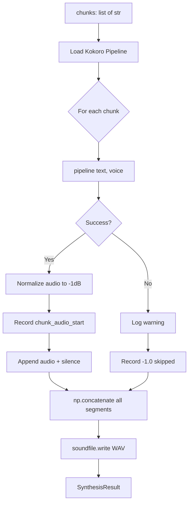

# Step 3: TTS Synthesis

**Module:** `src/openshelf/pipeline/tts.py`
**Test:** `tests/pipeline/test_tts.py`

## Purpose

Generate audio for a chapter's text chunks using Kokoro TTS. Produces a WAV file with silence gaps between chunks and records the exact audio timestamp where each chunk begins — these offsets feed into the word alignment step.



## Interface

### Dataclasses

```python
@dataclass
class ChapterAudio:
    chapter_number: int
    title: str
    wav_path: str
    duration_seconds: float
    word_count: int

@dataclass
class SynthesisResult:
    duration_seconds: float
    skipped_chunks: int
    chunk_audio_starts: list[float]  # len == len(input chunks); -1.0 for skipped
```

### Public Functions

```python
def get_device() -> str
    # Returns "cuda" > "mps" > "cpu"

def load_pipeline(device: str | None = None) -> KPipeline
    # Lazy-loads Kokoro; uses get_device() if device is None

def synthesize_chapter(
    pipeline: KPipeline,
    chunks: list[str],
    output_path: str,
    voice: str = TTS_VOICE,            # "af_heart"
    sample_rate: int = TTS_SAMPLE_RATE, # 24000
    silence_ms: int = SILENCE_BETWEEN_CHUNKS_MS,  # 400
) -> SynthesisResult
```

## Behavior

### Timing Model

Silence is inserted **between** chunks (not before the first):

```
[chunk0_audio][silence][chunk1_audio][silence][chunk2_audio]
```

- Chunk 0 starts at frame 0
- Chunk 1 starts at `len(chunk0_audio) + silence_frames`
- `audio_start_s = frames_so_far / sample_rate`

### chunk_audio_starts

One entry per input chunk, in order:
- Successful chunks: the time in seconds where that chunk's audio begins in the WAV
- Failed chunks: `-1.0` (TTS returned no audio or raised an exception)

This list is the same length as the input `chunks` list, preserving index alignment for downstream steps (word alignment, chunk-to-element mapping).

### Peak Normalization

Each chunk's audio is normalized to a peak amplitude of 0.89 (~-1dB) before concatenation. Prevents volume jumps between TTS invocations. Silent audio (all zeros) is left unchanged.

### Error Handling

- Empty `chunks` list: raises `ValueError`
- Single chunk fails: logged as warning, marked `-1.0`, pipeline continues
- All chunks fail: raises `RuntimeError`

### Lazy Imports

`torch` and `kokoro.KPipeline` are imported on first use, not at module load time. This keeps the module importable in test environments without GPU dependencies.

## Dependencies

- `kokoro` — TTS engine (lazy import)
- `torch` — device detection (lazy import)
- `numpy` — audio array operations
- `soundfile` — WAV writing
- Config: `TTS_VOICE`, `TTS_LANGUAGE`, `TTS_SAMPLE_RATE`, `SILENCE_BETWEEN_CHUNKS_MS`
