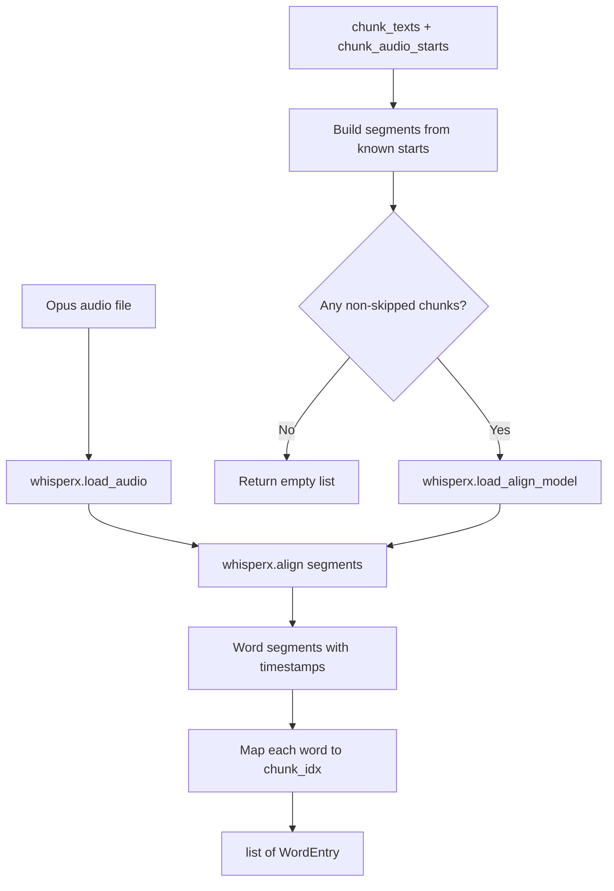

# Step 5b: Word Aligner

**Module:** `src/openshelf/pipeline/word_aligner.py`
**Test:** `tests/pipeline/test_word_aligner.py`

## Purpose

Run WhisperX forced alignment on each chapter's audio to produce word-level timestamps. Each word is tagged with its chunk index, enabling precise text/audio sync — the client can highlight individual words as they're spoken.



## Interface

### Dataclass

```python
@dataclass
class WordEntry:
    word: str
    start: float       # seconds, rounded to 4 decimal places
    end: float         # seconds, rounded to 4 decimal places
    chunk_idx: int     # index into the chapter's chunk list
```

### Public Functions

```python
def align_chapter(
    audio_path: str,
    chunk_texts: list[str],
    chunk_audio_starts: list[float],   # from SynthesisResult; -1.0 = skipped
    device: str = "cpu",
    language: str = "en",
) -> list[WordEntry]

def write_word_alignment(
    chapters: list[dict],   # [{"number": int, "words": list[WordEntry]}]
    rendition: str,
    output_path: str,
) -> str  # returns output_path
```

## Behavior

### Segment Construction

WhisperX needs pre-segmented text with approximate time boundaries. These are built from `chunk_audio_starts`:

- For each chunk where `audio_start >= 0.0`: create a segment with `text`, `start`, and `end`
- The segment's `end` is the next non-skipped chunk's start time (or `inf` for the last chunk)
- Skipped chunks (`-1.0`) are excluded entirely

### Word-to-Chunk Mapping

After WhisperX returns word timestamps, each word is assigned to a chunk by finding which segment boundary it falls within (`seg_start <= word_start < seg_end`).

### Idempotency

`write_word_alignment` skips writing if the output file already exists.

### word_alignment.json Format

```json
{
  "version": 1,
  "rendition": "kokoro-af-heart",
  "chapters": [
    {
      "number": 1,
      "words": [
        {"word": "The", "start": 0.0, "end": 0.12, "chunk_idx": 0},
        {"word": "morning", "start": 0.12, "end": 0.45, "chunk_idx": 0},
        {"word": "sun", "start": 0.48, "end": 0.72, "chunk_idx": 0}
      ]
    }
  ]
}
```

### Edge Cases

- All chunks skipped (`-1.0`): returns empty word list for that chapter
- Pre-existing Opus files (no chunk_audio_starts from TTS): all starts are `-1.0`, alignment returns empty — frontend degrades gracefully

### Lazy Import

`whisperx` is imported inside `align_chapter()`, not at module level. This keeps the module importable in environments without the WhisperX dependency.

## Dependencies

- `whisperx` — forced alignment engine (lazy import)
- Standard library (dataclasses, json, os)
