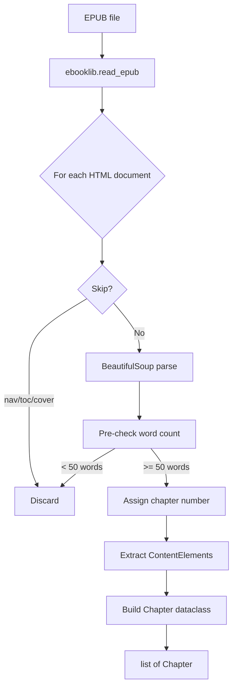

# Step 1: EPUB Parser

**Module:** `src/openshelf/pipeline/epub_parser.py`
**Test:** `tests/pipeline/test_epub_parser.py`

## Purpose

Parse an EPUB file into a list of chapters, each containing structured content elements with stable IDs. These IDs are the foundation for text/audio synchronization — they become DOM anchors in the annotated EPUB and let downstream chunks reference specific paragraphs by ID.



## Interface

### Dataclasses

```python
@dataclass
class ContentElement:
    id: str        # "ch3-el0012" — stable, chapter-scoped
    tag: str       # "p", "h2", "blockquote", "li", "figcaption"
    html: str      # outer HTML with id attribute injected
    text: str      # plain text after cleaning
    spoken: bool   # False for footnotes, endnotes, toc, pagebreak

@dataclass
class Chapter:
    number: int                       # 1-indexed, gap-free
    title: str                        # from h1 > h2 > h3 > "Chapter N"
    elements: list[ContentElement]    # all content elements with IDs
    paragraphs: list[str]             # [el.text for el in elements if el.spoken]
    text: str                         # "\n\n".join(paragraphs)
    word_count: int                   # len(text.split())
    epub_item_name: str = ""          # EPUB item filename (for annotator)
```

### Public Function

```python
def parse_epub(epub_path: str) -> list[Chapter]
```

## Behavior

### Document Filtering

Items are skipped if their filename (case-insensitive) contains any of: `nav`, `toc`, `cover`. Titlepage is intentionally kept — it becomes the audiobook opening.

Word count is checked **before** assigning a chapter number, so filtered items don't cause gaps in numbering or element IDs.

### Content Tags

Only these tags are extracted as content elements:
`p`, `h1`, `h2`, `h3`, `h4`, `h5`, `h6`, `blockquote`, `li`, `figcaption`

### HTML Cleaning

- `<sup>` and `<sub>` tags are removed (footnote markers)
- `<a>` tags with numeric-only content are removed (cross-references like `[1]`)
- Non-numeric anchors are preserved (their text is kept)
- Whitespace is normalized to single spaces within each element

### Spoken Detection

An element is `spoken=False` if it or any ancestor has an `epub:type` attribute containing any of: `footnote`, `endnote`, `toc`, `pagebreak`. Only spoken elements go to TTS.

### Element ID Format

`ch{chapter_number}-el{sequential_index:04d}` — e.g. `ch3-el0012`. Sequential index is zero-based per chapter, incremented for each non-empty content element.

### Title Extraction

First `h1` found in the document, falling back to `h2`, then `h3`, then `"Chapter N"`. Headings are also stored as the first spoken element of the chapter, so the TTS reads them as the chapter opens.

### Heading Normalization for TTS

Heading element `text` is rewritten before being passed downstream so Kokoro reads numerals naturally instead of letter-by-letter. The HTML stored in `ContentElement.html` is **not** changed — display still shows the original.

Patterns rewritten (case-insensitive on Roman numerals):

- `"I"`, `"II"`, `"IV"`, … → `"Chapter 1."`, `"Chapter 2."`, `"Chapter 4."`
- `"1"`, `"12"`, … → `"Chapter 1."`, `"Chapter 12."`
- `"III. The Storm"` / `"3. The Storm"` → `"Chapter 3. The Storm."`
- `"Chapter II"` → `"Chapter 2."`

Other headings (e.g. `"The Storm"`) are left untouched.

This also fixes a secondary issue: a single-letter heading like `"I"` synthesized in isolation produced an audible onset transient at chapter start.

### Fallback Text Extraction

If no `<p>` tags yield text, falls back to `soup.get_text()` (handles `<div>`-based EPUBs). The entire text becomes a single-element `paragraphs` list.

## Dependencies

- `ebooklib` — EPUB reading
- `beautifulsoup4` — HTML parsing
- `re` — whitespace normalization, numeric anchor detection
