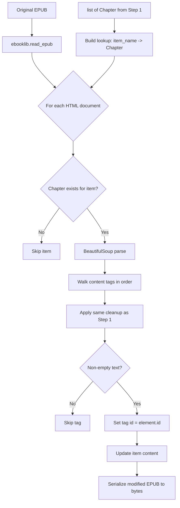

# Step 1b: EPUB Annotator

**Module:** `src/openshelf/pipeline/epub_annotator.py`
**Test:** `tests/pipeline/test_epub_annotator.py`

## Purpose

Inject stable `id` attributes from Step 1's `ContentElement` objects back into the original EPUB HTML. The output is a modified EPUB file that a reader app can render — every narrated element is addressable in the DOM via `document.getElementById("ch3-el0012")`.



## Interface

### Public Function

```python
def annotate_epub(epub_path: str, chapters: list[Chapter]) -> bytes
```

**Input:**
- `epub_path` — path to the original EPUB file
- `chapters` — list of Chapter objects from `parse_epub()` (with `epub_item_name` and `elements`)

**Output:** Modified EPUB as `bytes` (a valid EPUB zip file). Caller writes this to disk.

## Behavior

### Tag Walking

Replays the **exact same** tag-walking and cleanup logic as `epub_parser._extract_content_elements`:
1. Find all content tags (`p`, `h1`-`h6`, `blockquote`, `li`, `figcaption`)
2. Skip outer content containers that contain nested content tags, so text is not duplicated
3. Decompose `<sup>`, `<sub>` tags
4. Decompose `<a>` tags with numeric-only content
5. Skip tags with empty text after cleanup
6. Assign the next `ContentElement.id` to the tag

This mirror is critical — if the walking order diverges from Step 1, IDs would be misassigned.

### Item Matching

Chapters are matched to EPUB items via `Chapter.epub_item_name`. Items that were filtered in Step 1 (nav, toc, cover, short) are skipped.

### Output

The function returns raw bytes, not a file path. The caller decides where to save it (typically `{book_dir}/book-annotated.epub`). This is the EPUB uploaded to R2 as `book.epub`.

## Dependencies

- `ebooklib` — EPUB read/write
- `beautifulsoup4` — HTML parsing and modification
- `epub_parser` — imports `Chapter`, `_CONTENT_TAGS`
