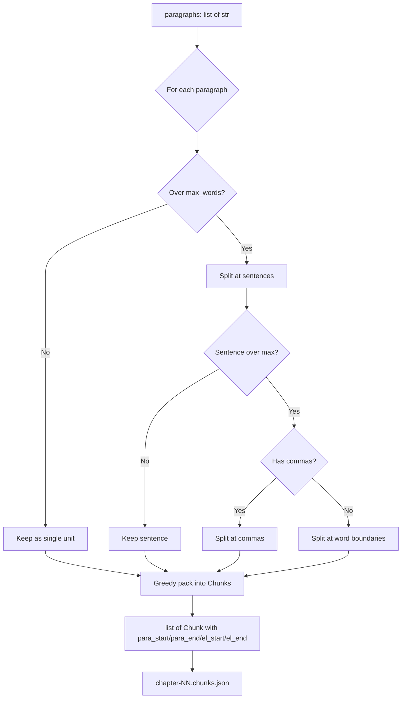

# Step 2: Text Chunker

**Module:** `src/openshelf/pipeline/text_chunker.py`
**Test:** `tests/pipeline/test_text_chunker.py`

## Purpose

Split a chapter's spoken paragraphs into TTS-sized chunks (max 200 words),
preserving paragraph boundaries and tracking which source paragraphs and element
IDs each chunk covers. This mapping is what enables text/audio sync: given a
chunk index, later stages can find the exact DOM elements it corresponds to.
Smaller chunks (200 vs the original 450) improve TTS prosody; Kokoro produces
more natural intonation on shorter passages.



## Interface

### Dataclass

```python
@dataclass
class Chunk:
    text: str           # chunk text (paragraphs joined with "\n\n")
    para_start: int     # index of first paragraph in Chapter.paragraphs
    para_end: int       # index of last paragraph (inclusive)
    el_start: str = ""  # element ID of first spoken element
    el_end: str = ""    # element ID of last spoken element
```

### Public Functions

```python
def chunk_text(
    paragraphs: list[str],
    max_words: int = CHUNK_MAX_WORDS,       # 200
    element_ids: list[str] | None = None,   # parallel to paragraphs
) -> list[Chunk]

def build_chapter_chunks_artifact(
    chapter_number: int,
    title: str,
    chunks: list[Chunk],
) -> dict

def write_chapter_chunks_artifact(
    path: str,
    chapter_number: int,
    title: str,
    chunks: list[Chunk],
    force: bool = False,
) -> str

def read_chapter_chunks_artifact(path: str) -> dict
```

## Behavior

### Chunking Algorithm

1. **Pre-split** oversized paragraphs (> `max_words`) into sub-units at sentence boundaries
2. **Greedy pack** paragraph units into chunks up to `max_words`
3. Multiple short paragraphs can share a chunk; chunks never cross paragraph boundaries within a single pack step

### Sentence Splitting

Splits on `(?<=[.!?])\s+` with abbreviation protection. Known abbreviations
(Mr., Dr., etc.) and single uppercase initials (J. K. Rowling) have their
periods temporarily replaced to prevent false splits.

### Oversized Handling

If a sentence exceeds `max_words`:

1. Try splitting at `, ` (comma + space)
2. If still oversized, split at word boundaries (hard split every `max_words` words)

### Element ID Tracking

When `element_ids` is provided (parallel list to `paragraphs`), each chunk
records `el_start` and `el_end`, the element IDs of its first and last source
paragraph. This is what lets later stages map `chunk_idx` to a DOM element range
in the annotated EPUB.

### Chapter Chunk Artifact

After chunking, the pipeline writes one deterministic chunk artifact per chapter
inside the build directory:

```text
audio/{rendition}/builds/{build}/chapter-NN.chunks.json
```

The artifact is the canonical chapter text input for direction, synthesis, sync
repair, and `chapter_data.json` assembly:

```json
{
  "version": 1,
  "number": 1,
  "title": "Chapter 1",
  "chunks": [
    {
      "index": 0,
      "text": "Reader text",
      "para_start": 0,
      "para_end": 1,
      "el_start": "ch1-el0000",
      "el_end": "ch1-el0001",
      "text_hash": "sha256:..."
    }
  ]
}
```

`text_hash` is a stable SHA-256 hash of the exact reader text in that chunk,
encoded as `sha256:<hex>`. Artifact writers are idempotent: if the output file
already exists, they skip when the payload is identical, fail when it differs,
and overwrite only when `force=True`.

`chapter_data.json` remains the public reader contract, but it is assembled from
these chunk artifacts plus per-chunk word timestamps rather than treating the
in-memory chunk list as the only durable source.

### Invariants

- No chunk exceeds `max_words` words
- All words from input paragraphs appear in output chunks (no data loss)
- Word order is preserved
- No chunk internally contains text from non-adjacent paragraphs
- Chunk artifact `chunks[*].index` values are contiguous and start at zero
- Chunk artifact `text_hash` values are derived only from `chunks[*].text`

## Dependencies

- `config.CHUNK_MAX_WORDS` (200)
- Standard library only (dataclasses, hashlib, json, os, re)
