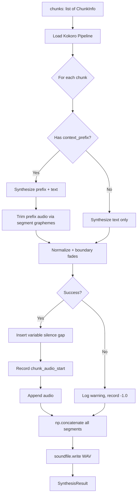

# Step 3: TTS Synthesis

**Module:** `src/openshelf/pipeline/tts.py`
**Test:** `tests/pipeline/test_tts.py`

## Purpose

Generate audio for a chapter's text chunks using Kokoro TTS. Produces a WAV file with variable silence gaps between chunks, applies crossfading at chunk boundaries, and optionally uses context overlap from the previous chunk for prosodic continuity. Records the audio timestamp where each chunk begins **and** extracts per-word start/end timestamps directly from Kokoro's token output — no separate alignment pass is needed for sync.



## Interface

### Dataclasses

```python
@dataclass
class ChunkInfo:
    text: str
    ends_paragraph: bool = True    # whether this chunk ends a paragraph
    context_prefix: str = ""       # trailing sentences from previous chunk for prosody

@dataclass
class ChapterAudio:
    chapter_number: int
    title: str
    wav_path: str
    duration_seconds: float
    word_count: int

@dataclass
class WordTimestamp:
    word: str
    start: float       # seconds, relative to start of final chapter audio
    end: float

@dataclass
class SynthesisResult:
    duration_seconds: float
    skipped_chunks: int
    chunk_audio_starts: list[float]              # len == len(input chunks); -1.0 for skipped
    chunk_words: list[list[WordTimestamp]]       # words per chunk, [] for skipped
```

### Public Functions

```python
def get_device() -> str
    # Returns "cuda" > "mps" > "cpu"

def load_pipeline(device: str | None = None) -> KPipeline
    # Lazy-loads Kokoro; uses get_device() if device is None

def synthesize_chapter(
    pipeline: KPipeline,
    chunks: list[ChunkInfo],
    output_path: str,
    voice: str = TTS_VOICE,            # "af_heart"
    sample_rate: int = TTS_SAMPLE_RATE, # 24000
) -> SynthesisResult
```

## Behavior

### Timing Model

Variable silence is inserted **between** chunks (not before the first). Gap duration depends on whether the previous chunk ended a paragraph:

```
[chunk0_audio][paragraph_gap][chunk1_audio][mid_para_gap][chunk2_audio]
```

- Paragraph break: `SILENCE_PARAGRAPH_BREAK_MS` (700ms)
- Mid-paragraph: `SILENCE_MID_PARAGRAPH_MS` (200ms)
- Chunk 0 starts at frame 0
- `audio_start_s = frames_so_far / sample_rate`

### Boundary Fades (Crossfading)

Each chunk's audio gets a short fade-in at the start and fade-out at the end (`CROSSFADE_MS`, default 15ms / ~360 samples at 24kHz). This eliminates click artifacts at chunk boundaries. Audio length is unchanged — fades are applied in-place. Chunks shorter than `2 * fade_samples` are left untouched.

### Context Overlap

When `ChunkInfo.context_prefix` is set (typically the last 2 sentences of the previous chunk), the synthesis step:

1. Synthesizes `context_prefix + " " + text` as a single string, giving Kokoro prosodic context for natural continuation
2. Trims the prefix audio using Kokoro's segment grapheme boundaries — each `pipeline()` call yields a `Result` object with `.graphemes`, `.audio`, and `.tokens`, and we accumulate grapheme text until it covers the prefix, then keep only subsequent segments
3. Falls back to proportional word-count trimming if all text lands in a single segment
4. Applies a fade-in at the trim point to mask any splice artifact
5. If a synthesis call fails or produces unusable output, the chunk is retried once **without** the prefix before being marked as failed

This means `chunk_audio_starts` points to where the **real content** (post-trim) begins, not the prefix.

### Word Timestamps (`chunk_words`)

Kokoro's `Result.tokens` is a list of `MToken` objects, each with `.text`, `.start_ts`, `.end_ts`. After synthesis, `_extract_words` walks the tokens for each chunk and:

- Skips tokens with no timestamps (control / pause tokens)
- Skips tokens whose `start_ts` falls inside the trimmed prefix (i.e. `start_ts < trim_offset - 0.01`)
- Subtracts `trim_offset` so timestamps are relative to the start of the chunk's kept audio
- Adds `chunk_audio_starts[i]` so timestamps are absolute within the chapter audio

The result is a `list[list[WordTimestamp]]` aligned 1:1 with the input chunks. Failed chunks get an empty list. These get serialized into `chapter_data.json` (see Step 6 / convert-book.py).

### chunk_audio_starts

One entry per input chunk, in order:
- Successful chunks: the time in seconds where that chunk's audio begins in the WAV
- Failed chunks: `-1.0` (TTS returned no audio or raised an exception)

This list is the same length as the input `chunks` list, preserving index alignment for downstream steps (word alignment, chunk-to-element mapping).

### Peak Normalization

Each chunk's audio is normalized to a peak amplitude of 0.89 (~-1dB) before concatenation. Prevents volume jumps between TTS invocations. Silent audio (all zeros) is left unchanged.

### Error Handling

- Empty `chunks` list: raises `ValueError`
- Single chunk fails: logged as warning, marked `-1.0`, pipeline continues
- All chunks fail: raises `RuntimeError`

### Lazy Imports

`torch` and `kokoro.KPipeline` are imported on first use, not at module load time. This keeps the module importable in test environments without GPU dependencies.

### Internal Helpers

- `_generate_silence(sample_rate, duration_ms)` — generates a zero-filled numpy array
- `_normalize(audio, target_peak=0.89)` — peak normalization
- `_apply_boundary_fades(audio, sample_rate, fade_ms)` — fade-in/fade-out at chunk edges
- `_split_segments_at_prefix(results, context_prefix, sample_rate, fade_ms) -> (audio, trim_samples)` — trims prefix audio using segment graphemes; returns the kept audio and the number of samples that were dropped (used to derive `trim_offset` for word timestamps)
- `_extract_words(results, trim_offset) -> list[WordTimestamp]` — walks Kokoro tokens, filters out prefix tokens and tokens without timestamps, returns chunk-relative timestamps
- `_synthesize_single_chunk(pipeline, chunk_info, voice, sample_rate)` — runs a single chunk through TTS; on failure retries once without the context prefix
- `_text_for_matching(text)` — normalizes text for prefix matching (lowercase, strip punctuation)

## Dependencies

- `kokoro` — TTS engine (lazy import)
- `torch` — device detection (lazy import)
- `numpy` — audio array operations
- `soundfile` — WAV writing
- Config: `TTS_VOICE`, `TTS_LANGUAGE`, `TTS_SAMPLE_RATE`, `SILENCE_PARAGRAPH_BREAK_MS`, `SILENCE_MID_PARAGRAPH_MS`, `CROSSFADE_MS`
