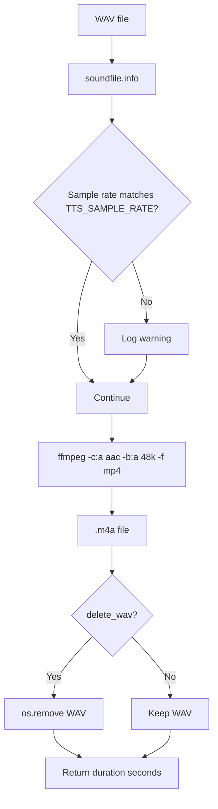

# Step 4: Encoder

**Module:** `src/openshelf/pipeline/encoder.py`
**Test:** `tests/pipeline/test_encoder.py`

## Purpose

Convert a WAV file to AAC format in an M4A container using ffmpeg. Returns the audio duration. AAC at 48kbps provides good speech quality with universal playback support (iOS, Android, Windows, macOS, all browsers).



## Interface

### Public Functions

```python
def audio_duration(path: str) -> float
    # Get duration of any audio file via ffprobe
    # Returns seconds as float

def encode_to_aac(
    wav_path: str,
    m4a_path: str,
    bitrate: str = AAC_BITRATE,   # "48k"
    delete_wav: bool = True,
) -> float
    # Returns duration in seconds (from WAV sample count, not ffprobe)
```

## Behavior

### Encoding

Runs ffmpeg as a subprocess: `ffmpeg -i <wav> -c:a aac -b:a 48k -f mp4 -y <m4a>`

The `-y` flag overwrites existing output (safe because the caller checks for existence before calling).

### Duration Calculation

Duration is calculated from the WAV's frame count divided by sample rate (`soundfile.info`). This is exact — no ffprobe rounding.

### Sample Rate Check

If the WAV sample rate doesn't match `TTS_SAMPLE_RATE` (24000 Hz), a warning is logged but encoding proceeds. ffmpeg handles resampling transparently.

### Output Directory

Parent directories of `m4a_path` are created with `os.makedirs(exist_ok=True)`.

### WAV Cleanup

By default, the source WAV is deleted after successful encoding. Pass `delete_wav=False` to keep it (useful for debugging or re-encoding).

### Error Propagation

- WAV file doesn't exist: `FileNotFoundError` from `soundfile.info`
- ffmpeg fails: `subprocess.CalledProcessError` from `subprocess.run(check=True)`
- Both propagate to the caller — no silent swallowing

## Dependencies

- `ffmpeg` — system binary (AAC encoder is built-in)
- `soundfile` — WAV metadata reading
- Config: `AAC_BITRATE` ("48k"), `TTS_SAMPLE_RATE` (24000)
