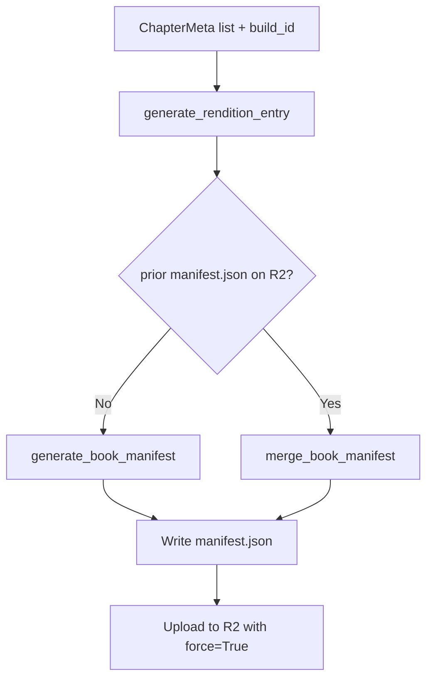

# Step 5a: Book Manifest

**Module:** `src/openshelf/pipeline/manifest.py`
**Test:** `tests/pipeline/test_manifest.py`

## Purpose

The book-level `manifest.json` is the **only mutable per-book artifact on R2**. It is a tiny pointer file that lists the renditions available for a book and names the `current_build` per rendition.

The per-build artifacts (audio, chapter_data, rendition-manifest) are immutable and live under a build-versioned R2 prefix (`audio/{rendition}/builds/{build}/`). The EPUB and cover are also immutable but live at the book root (`book.epub`, `cover.{ext}`) because they do not vary by rendition or build. Clients hit the book manifest first, read the `current_build` for the rendition the user picked, then construct immutable URLs for the actual content.



## Interface

### Dataclasses

```python
@dataclass
class ChapterMeta:
    number: int
    title: str
    filename: str           # "chapter-01.m4a"
    duration_seconds: float
    word_count: int

@dataclass
class RenditionEntry:
    voice: str              # "af_heart"
    engine: str             # "kokoro"
    display: str            # "Heart" — user-facing label
    current_build: str      # 16-hex build_id (random, fresh per pipeline run)
    available_builds: list[str]   # all builds still resident on R2, current first
```

### Public Functions

```python
def generate_rendition_entry(
    voice: str,
    engine: str,
    display: str,
    build_id: str,
) -> RenditionEntry
    # Construct a fresh entry with available_builds=[build_id].

def generate_book_manifest(
    author: str,
    title: str,
    source: str,
    renditions: dict[str, RenditionEntry],   # keyed by rendition slug
    output_dir: str,
) -> str  # returns path to manifest.json
    # Writes a from-scratch manifest. Use when no prior exists; otherwise merge first
    # and serialize the merged dict yourself (this function takes RenditionEntry,
    # merge_book_manifest returns a dict).

def merge_book_manifest(
    prior_manifest: dict,
    rendition: str,
    new_entry: RenditionEntry,
    retain: int = 2,                          # keep last N builds
) -> dict
    # Pure. Updates `current_build` to new_entry.current_build, prepends it to
    # `available_builds`, deduplicates, trims to `retain`. Other renditions in
    # the prior manifest are preserved untouched. Caller's prior dict is not mutated.
```

## Behavior

### `manifest.json` shape

```json
{
  "title": "The Metamorphosis",
  "author": "Franz Kafka",
  "source": "gutenberg",
  "renditions": {
    "kokoro-af-heart": {
      "voice": "af_heart",
      "engine": "kokoro",
      "display": "Heart",
      "current_build": "2a4f9c1b3d8e7f60",
      "available_builds": ["2a4f9c1b3d8e7f60", "7e8b4d2a9c0e1234"]
    }
  }
}
```

- The keys of `renditions` are the rendition slugs used in R2 paths and HTTP query params.
- `available_builds` is ordered most-recent-first and includes `current_build` at index 0.
- `display` is purely a UI string.

### Mutability

This file is **always overwritten** on upload (`upload_book_manifest(..., force=True)`). It is the only object in the per-book namespace that the worker treats as mutable. Its R2 key has `Cache-Control: public, max-age=60, stale-while-revalidate=86400`.

### Merge semantics

When reprocessing produces a new build for a rendition that already has prior builds on R2:

1. Insert `new_entry.current_build` at the front of `available_builds`.
2. Deduplicate defensively if the same build ID is already listed.
3. Truncate to the most recent `retain` builds. Older entries are dropped from the list **but their R2 objects are not deleted**; a separate GC step (see `step6-r2.md`) removes orphaned bytes.
4. Other renditions in the prior manifest are preserved unchanged.

### Where chapter durations and word counts go

They no longer live in this file. Those move to the **per-build rendition manifest** (`step5c-rendition-manifest.md`), which is itself an immutable artifact under the build prefix. This file stays small and stable across reprocesses that don't change the rendition set.

### How clients see chapter lists

The on-R2 book manifest never carries a chapter list. The **worker** is responsible for stitching the chapter list onto the `GET /books/:a/:t` response: for each rendition, it reads that rendition's `current_build`'s `rendition-manifest.json` from R2 and inlines the `chapters` array into the per-rendition entry it returns. The merged response is what the client sees; the on-R2 file stays small.

This keeps the only mutable per-book file on R2 tiny (one short-cached read per book-detail load) while letting the worker serve a single, rich response from one HTTP call. See `worker/CLAUDE.md` for the response shape.

### How clients discover retained builds

The on-R2 book manifest's `available_builds` list is the authoritative retained build list for each rendition, but it only stores build IDs. The worker's `GET /books/:a/:t/builds` route enriches those IDs by reading each retained build's `rendition-manifest.json`, returning the exact engine, voice, R2 upload timestamp, pipeline version, duration, and chapter metadata available for advanced client build selection. The upload timestamp comes from the R2 object metadata for `rendition-manifest.json`; it is not embedded in the immutable manifest JSON. This route is not cached because the retained build list changes frequently. Clients that do not request or pass an explicit build keep using `current_build`.

## Dependencies

- Standard library only (json, os)
