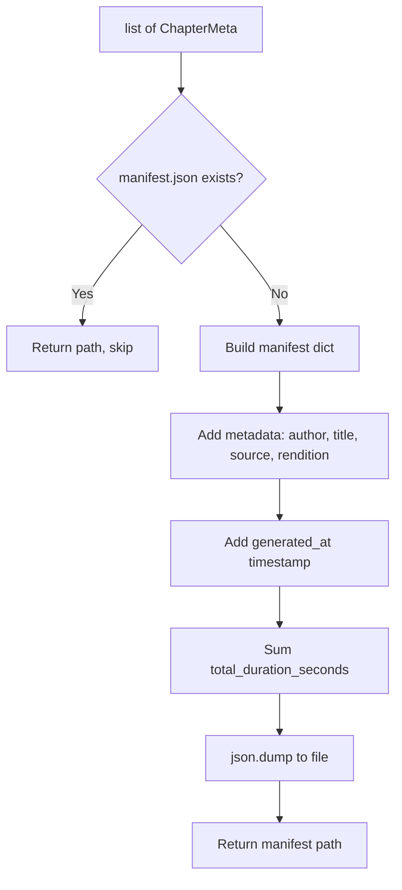

# Step 5a: Manifest

**Module:** `src/openshelf/pipeline/manifest.py`
**Test:** `tests/pipeline/test_manifest.py`

## Purpose

Generate a `manifest.json` file containing book and chapter metadata. This is the entry point for client apps — it tells them what chapters exist, their filenames, durations, and word counts.



## Interface

### Dataclass

```python
@dataclass
class ChapterMeta:
    number: int
    title: str
    filename: str           # "chapter-01.m4a"
    duration_seconds: float
    word_count: int
```

### Public Function

```python
def generate_manifest(
    author: str,
    title: str,
    source: str,                    # "gutenberg" or "standard-ebooks"
    chapters: list[ChapterMeta],
    output_dir: str,
    rendition: str = "",            # "kokoro-af-heart"
    chunks_version: int = 0,        # chunks.json version (currently 3)
) -> str  # returns path to manifest.json
```

## Behavior

### Idempotency

If `manifest.json` already exists in `output_dir`, the function returns its path immediately without writing. This means a manifest is never overwritten — delete it to regenerate.

### Output Directory

Created with `os.makedirs(exist_ok=True)` if it doesn't exist.

### manifest.json Format

```json
{
  "title": "Crime and Punishment",
  "author": "Fyodor Dostoevsky",
  "source": "gutenberg",
  "rendition": "kokoro-af-heart",
  "chunks_version": 3,
  "generated_at": "2026-03-15T10:30:00+00:00",
  "total_duration_seconds": 77400.5,
  "chapters": [
    {
      "number": 1,
      "title": "Part I, Chapter I",
      "filename": "chapter-01.m4a",
      "duration_seconds": 1847.3,
      "word_count": 3241
    }
  ]
}
```

### Fields

| Field | Source |
|---|---|
| `title`, `author` | EPUB DC metadata |
| `source` | CLI `--source` flag |
| `rendition` | CLI `--rendition` flag |
| `chunks_version` | Read from `chunks.json` at generation time |
| `generated_at` | UTC ISO-8601 timestamp |
| `total_duration_seconds` | Sum of all chapter durations |
| `chapters[].filename` | Constructed by caller (e.g. `chapter-01.m4a`) |
| `chapters[].duration_seconds` | From encoder or ffprobe |
| `chapters[].word_count` | From epub_parser |

## Dependencies

- Standard library only (json, os, datetime)
