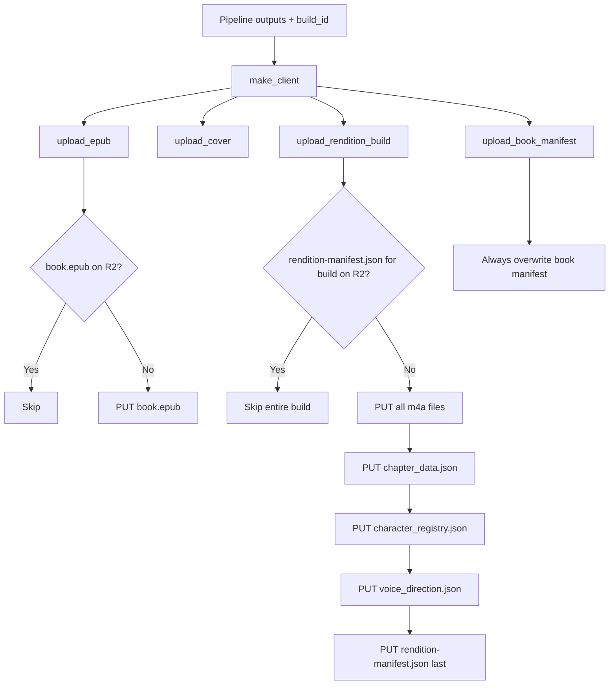

# Step 6: R2 Upload

**Module:** `src/openshelf/pipeline/r2.py`
**Test:** `tests/pipeline/test_r2.py`

## Purpose

Upload all pipeline artifacts to Cloudflare R2 (S3-compatible object storage) under a build-versioned key layout. Per-build artifacts (audio, chapter_data, character_registry, voice_direction, rendition-manifest) live under `audio/{rendition}/builds/{build}/...` and are immutable once written. The per-book `manifest.json` is the single mutable pointer that names the `current_build` per rendition and is always overwritten on upload.



## Interface

### Public Functions

```python
def make_client() -> boto3.client
    # S3 client configured for R2 using env vars

def key_exists(client, bucket: str, key: str) -> bool
    # HEAD request; True if exists, False on 404, re-raises other errors

def upload_rendition_build(
    client, bucket: str,
    author_slug: str, title_slug: str,
    rendition: str, build_id: str,
    audio_dir: str,
    chapter_data_path: str,
    rendition_manifest_path: str,
    character_registry_path: str | None = None,
    voice_direction_path: str | None = None,
    force: bool = False,
) -> list[str]
    # Writes all per-build artifacts under audio/{rendition}/builds/{build}/.
    # Single-gate idempotency: rendition-manifest.json existence signals the
    # build is complete. Returns uploaded keys (or [] if already complete).

def upload_book_manifest(
    client, bucket: str,
    author_slug: str, title_slug: str,
    manifest_path: str,
) -> str
    # Always overwrites. This is the single mutable pointer.

def upload_cover(
    client, bucket: str,
    author_slug: str, title_slug: str,
    cover_path: str,
    content_type: str = "image/jpeg",
    force: bool = False,
) -> str | None

def upload_epub(
    client, bucket: str,
    author_slug: str, title_slug: str,
    epub_path: str,
    force: bool = False,
) -> str | None
```

`force=True` on the per-artifact uploaders skips the HEAD existence check and overwrites — used by `reprocess-book.py`. The book manifest does not take `force` because it is unconditionally overwritten on every run.

## R2 Key Layout

```
books/{author_slug}/{title_slug}/
  book.epub                                              # immutable
  cover.{jpg|png}                                        # immutable
  manifest.json                                          # MUTABLE — the only mutable per-book object
  audio/
    {rendition}/                                         # e.g. kokoro-af-heart
      builds/
        {build_id}/                                      # 16-hex random, fresh per pipeline run
          chapter-01.m4a                                 # immutable
          chapter-02.m4a
          chapter_data.json                              # immutable
          character_registry.json                        # immutable
          voice_direction.json                           # immutable
          rendition-manifest.json                        # immutable; written last
```

Every key under a `builds/{build_id}/` prefix is part of a coherent atomic snapshot: the audio bytes, the chapter_data word timestamps, the character registry, the voice direction audit, and the rendition-manifest's chapter durations all describe the same build. A client that pins to a build hash for a chapter session is guaranteed not to see a mid-listen mismatch.

For local quality checks, `convert-book.py --chapters` may restrict generation to
one chapter or a comma/range list such as `2` or `2,4-5`. This writes the same
per-build artifact shapes, but with only the selected chapters in
`chapter_data.json`, `voice_direction.json`, and `rendition-manifest.json`. The
flag is for local sample builds and must not alter the public schema.

### Key constructors

All key construction goes through `pipeline/src/openshelf/pipeline/r2_keys.py` — never assemble paths inline. Mirrored on the worker side in `worker/src/utils/r2-keys.ts`; tests on both sides assert the same string outputs so the two languages can never drift.

## chapter_data.json shape

Unchanged from prior shape — only the path it lives at has changed.

```json
{
  "version": 1,
  "rendition": "kokoro-af-heart",
  "build": "2a4f9c1b3d8e7f60",
  "chapters": [
    {
      "number": 1,
      "title": "I",
      "word_count": 1234,
      "chunks": [
        {
          "text": "Someone must have been telling lies about Josef K.",
          "words": [
            {"word": "Someone", "start": 0.0,  "end": 0.31},
            {"word": "must",    "start": 0.31, "end": 0.48}
          ]
        }
      ]
    }
  ]
}
```

The `build` field is added so the file is self-identifying — a client that has the bytes can sanity-check it matches the build it pinned to.

## Direction Artifacts

`character_registry.json` contains the narrator voice plus every known speaking character, aliases, descriptions, and assigned voice specs. It is immutable under the build prefix so future client character-editing features can start from exactly the registry used for that audio.

`voice_direction.json` contains the build `cast_mode` plus the per-chapter,
per-chunk speaker and performance-direction plan used for synthesis. In default
`solo` mode those segments use the narrator voice; in opt-in `multicast` mode
they may switch voices by character. It preserves original reader text
separately from synthesis-only text, so steering cues never become reader text.

## Behavior

### Idempotency Strategy

**Per-build upload** uses a single-gate pattern: only `rendition-manifest.json` existence is checked. If it exists, the entire build is skipped. The manifest is uploaded **last**, so its presence guarantees every other byte in the build prefix is already on R2.

**Other per-book uploads** (EPUB, cover) check their own key existence independently.

**Book manifest** is always overwritten — no existence check.

Every pipeline run assigns a fresh random `build_id`, so a reprocess always uploads under a new build prefix and rewrites the book manifest to point there. The single-gate idempotency is for resuming a partially-failed *same-process* run (e.g. network blip mid-upload), not for cross-run deduplication.

### Cache Headers

| Object | Cache-Control | Why |
|---|---|---|
| `manifest.json` (book-level) | `public, max-age=60, stale-while-revalidate=86400` | Mutable pointer; clients converge on new builds within ~60s |
| Everything else | `public, max-age=31536000, immutable` | URL itself is build-pinned; bytes never change for that URL |

The cache headers stored on R2 objects are **defaults** — the worker overrides them per-route based on the same policy. R2 metadata only matters for direct R2-public-bucket access, which OpenShelf does not use.

### Garbage Collection

`available_builds` in the book manifest is truncated to the most recent N (default 2) on every reprocess. Older build hashes still have bytes on R2 — those are reaped by a separate `gc-old-builds.py` script that:

1. Lists all `audio/{rendition}/builds/*` prefixes for a book.
2. Reads the book manifest to learn which build IDs are retained.
3. Deletes all keys under prefixes whose build ID is not in the retained set.

This is not run in-line with the upload to keep reprocesses fast and to give an instant rollback window in case a freshly-shipped build is broken.

### Content Types

| File | Content-Type |
|---|---|
| `.m4a` | `audio/mp4` |
| `.epub` | `application/epub+zip` |
| `.json` | `application/json` |

### ContentDisposition

m4a files include `ContentDisposition: inline` so browsers stream instead of downloading.

### Client Configuration

```python
boto3.client(
    "s3",
    endpoint_url=f"https://{R2_ACCOUNT_ID}.r2.cloudflarestorage.com",
    aws_access_key_id=R2_ACCESS_KEY,
    aws_secret_access_key=R2_SECRET_KEY,
    region_name="auto",
)
```

Credentials come from environment variables: `R2_ACCOUNT_ID`, `R2_ACCESS_KEY`, `R2_SECRET_KEY`.

## Dependencies

- `boto3` — S3-compatible API client
- `botocore` — `ClientError` for HEAD 404 handling
- Config: `R2_ACCOUNT_ID`, `R2_ACCESS_KEY`, `R2_SECRET_KEY`, `R2_PREFIX_BOOKS`, `R2_CACHE_CONTROL_IMMUTABLE`, `R2_CACHE_CONTROL_MANIFEST`
