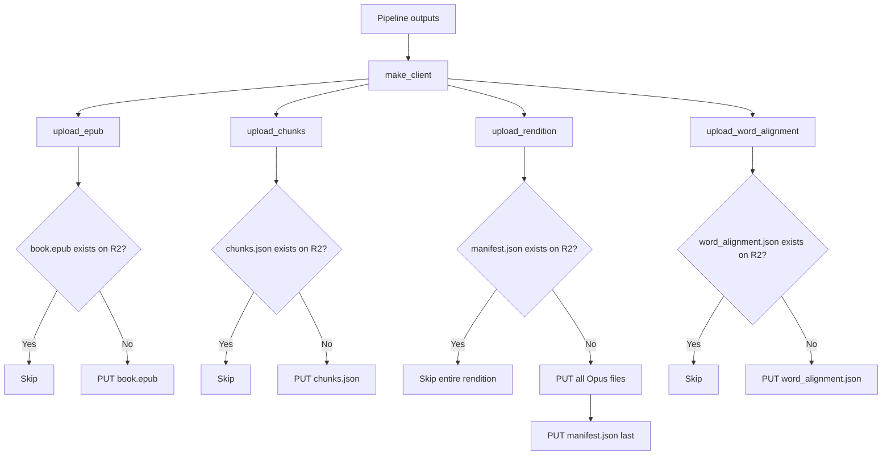

# Step 6: R2 Upload

**Module:** `src/openshelf/pipeline/r2.py`
**Test:** `tests/pipeline/test_r2.py`

## Purpose

Upload all pipeline artifacts to Cloudflare R2 (S3-compatible object storage). Each upload function is independently idempotent via HEAD checks. The rendition upload uses a single-gate idempotency pattern — only the manifest existence is checked, not each individual file.



## Interface

### Public Functions

```python
def make_client() -> boto3.client
    # S3 client configured for R2 using env vars

def key_exists(client, bucket: str, key: str) -> bool
    # HEAD request; True if exists, False on 404, re-raises other errors

def upload_rendition(
    client, bucket: str,
    author_slug: str, title_slug: str,
    rendition: str,
    audio_dir: str, manifest_path: str,
) -> list[str]
    # Returns list of uploaded R2 keys, or [] if already complete

def upload_epub(
    client, bucket: str,
    author_slug: str, title_slug: str,
    epub_path: str,
) -> str | None
    # Returns key or None if already exists

def upload_word_alignment(
    client, bucket: str,
    author_slug: str, title_slug: str,
    rendition: str,
    word_alignment_path: str,
) -> str | None

def upload_chunks(
    client, bucket: str,
    author_slug: str, title_slug: str,
    chunks_path: str,
) -> str | None
```

## R2 Key Layout

```
books/{author_slug}/{title_slug}/
  book.epub                                    # annotated EPUB
  chunks.json                                  # chunk-to-element mapping
  audio/{rendition}/
    chapter-01.m4a                            # audio files
    chapter-02.m4a
    manifest.json                              # chapter metadata
    word_alignment.json                        # word-level timestamps
```

## Behavior

### Idempotency Strategy

**Rendition upload** uses a single-gate pattern: only `manifest.json` existence is checked (one HEAD request). If it exists, the entire rendition is skipped. This works because manifest is always uploaded **last** — its presence guarantees all Opus files are already on R2. A partial previous run's files are safely overwritten on retry (PUT is idempotent).

**Other uploads** (EPUB, chunks, word alignment) each check their own key existence independently.

This avoids O(N) HEAD requests per book. For a 20-chapter book, it's 4 HEAD requests total instead of 24.

### Cache Headers

| File type | Cache-Control | Rationale |
|---|---|---|
| Opus, EPUB, chunks, alignment | `public, max-age=31536000, immutable` | Content never changes once written |
| manifest.json | `public, max-age=60` | Allows updates to propagate on reprocessing |

### Content Types

| File | Content-Type |
|---|---|
| `.m4a` | `audio/mp4` |
| `.epub` | `application/epub+zip` |
| `.json` | `application/json` |

### ContentDisposition

Opus files include `ContentDisposition: inline` so browsers stream instead of downloading.

### Client Configuration

```python
boto3.client(
    "s3",
    endpoint_url=f"https://{R2_ACCOUNT_ID}.r2.cloudflarestorage.com",
    aws_access_key_id=R2_ACCESS_KEY,
    aws_secret_access_key=R2_SECRET_KEY,
    region_name="auto",
)
```

Credentials come from environment variables: `R2_ACCOUNT_ID`, `R2_ACCESS_KEY`, `R2_SECRET_KEY`.

## Dependencies

- `boto3` — S3-compatible API client
- `botocore` — `ClientError` for HEAD 404 handling
- Config: `R2_ACCOUNT_ID`, `R2_ACCESS_KEY`, `R2_SECRET_KEY`, `R2_PREFIX_BOOKS`, `R2_CACHE_CONTROL_IMMUTABLE`, `R2_CACHE_CONTROL_MANIFEST`
