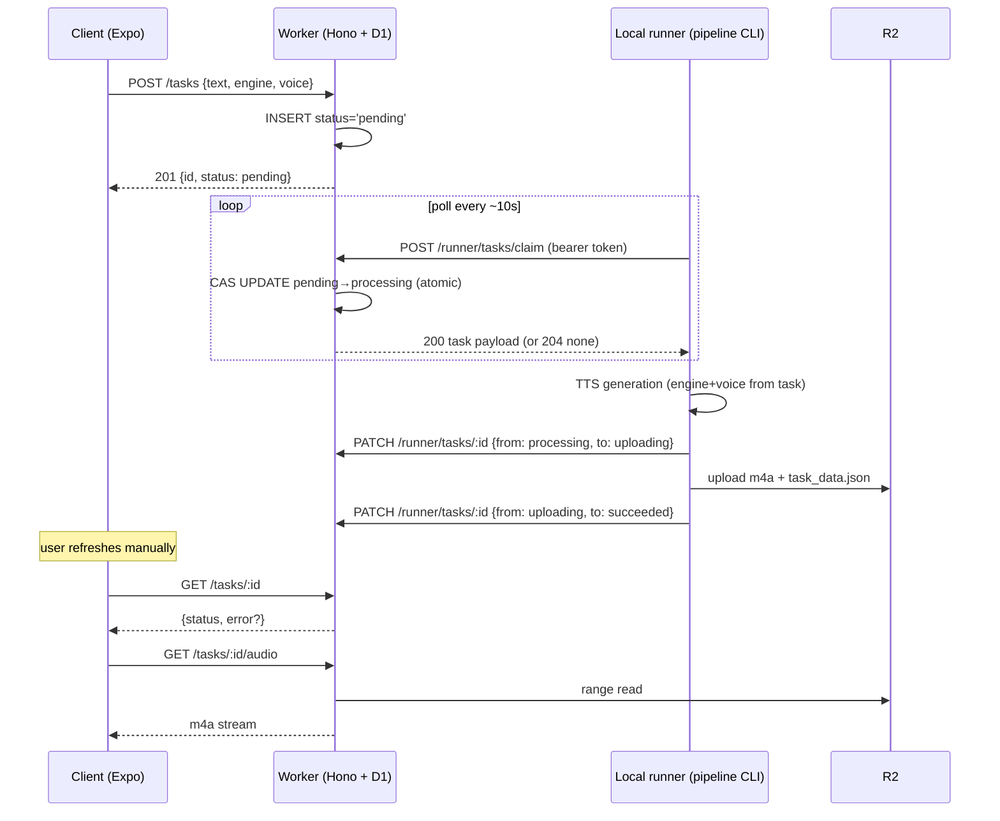

# Audio Generation Tasks — Architecture

Status: **design proposal** (nothing implemented yet)

## Goal

Let a client user submit ad-hoc text with a voice + engine selection, and have the local
pipeline machine pick the request up, generate audio, upload it, and report progress —
with a task lifecycle the client can observe:

```
pending → processing → uploading → succeeded
             │              │
             └──────────────┴────→ failed (with reason)
```

## Decisions at a glance

| Question | Decision |
|---|---|
| Database | **Cloudflare D1** (SQLite), bound to the existing worker |
| How the client "sends requests to the database" | It doesn't. The client only talks to the **worker REST API**; the worker owns all D1 access |
| How the local machine "listens" | It **polls a claim endpoint** on the worker (authenticated). No inbound connection to the local machine is needed |
| Atomic status update | A **conditional `UPDATE … WHERE status = <expected>`** (compare-and-swap). D1 executes each statement as a serialized transaction, so exactly one claimer can win |

## Why D1 (and not the alternatives)

- **Zero new infrastructure.** The worker already runs on Cloudflare with an R2 binding;
  D1 is one more `wrangler.toml` binding. No new vendor, no connection strings in the client.
- **The workload is tiny.** Tasks are human-created (a few per day, not per second). A
  serverless SQLite database is exactly the right size; Postgres/Supabase would add an
  account, credentials, and a second dashboard for no benefit.
- **Atomicity is trivially available.** D1 is a single-writer SQLite database: every
  statement is its own transaction, and `UPDATE … WHERE status='pending'` returning
  `meta.changes` gives us compare-and-swap semantics without row locks or advisory locks.
- Alternatives rejected:
  - **Cloudflare Queues** — push semantics sound right, but only a Worker can consume a
    queue. The consumer here is a local machine behind NAT, so we'd still need polling or
    a tunnel; and a queue gives the client no way to query task status. A status table is
    needed either way, so the table alone suffices.
  - **Durable Objects** — coordination power we don't need for a low-volume task table.
  - **Supabase / Neon (Postgres + realtime)** — `LISTEN/NOTIFY`-style push to the local
    runner is nice, but not worth a second platform. Polling every ~10 s costs one cheap
    indexed query and is well within latency expectations for multi-minute TTS jobs.

## Why the client never touches the database directly

The client (Expo web/iOS/Android) cannot hold database credentials — anything shipped in
the app bundle is public. Beyond secrecy:

- **Validation** — text length caps, engine/voice enums, one Zod schema per route (the
  worker's existing contract style; the OpenAPI spec stays machine-generated).
- **Authorization & rate limiting** live at the API layer (Turnstile or per-IP limits
  later, without touching the client).
- **Schema evolution** — the D1 schema can change without breaking shipped clients.

So the flow is always: **client → worker routes → D1**, and **runner → worker routes → D1**.
D1 has exactly one owner: the worker.

## Components



## D1 schema

```sql
CREATE TABLE tasks (
  id               TEXT PRIMARY KEY,      -- 16-hex random, same style as build ids
  status           TEXT NOT NULL DEFAULT 'pending'
                   CHECK (status IN ('pending','processing','uploading','succeeded','failed')),
  text             TEXT NOT NULL,          -- the input text (capped, e.g. 20k chars)
  engine           TEXT NOT NULL,          -- 'kokoro' | 'f5tts' | ...
  voice            TEXT NOT NULL,          -- engine-scoped voice id, e.g. 'af_heart'
  title            TEXT,                   -- optional user label
  error            TEXT,                   -- failure reason, set only when status='failed'
  attempts         INTEGER NOT NULL DEFAULT 0,
  lease_expires_at TEXT,                   -- ISO8601; set on claim, extended by heartbeat
  created_at       TEXT NOT NULL,
  updated_at       TEXT NOT NULL
);

CREATE INDEX idx_tasks_claim ON tasks(status, created_at);
```

Notes:

- `id` is generated by the worker (`crypto.randomUUID()` or 16-hex to match build ids).
- The **lease** exists because the runner can die mid-generation. A claim sets
  `lease_expires_at = now + 15min`; the runner heartbeats (`PATCH … {extend_lease: true}`)
  during long jobs. The claim query treats an expired-lease `processing` task as claimable
  again (bumping `attempts`); after `attempts >= 3` it is failed with reason
  `"lease expired after 3 attempts"`. Without this, a crashed runner strands tasks in
  `processing` forever.

## Worker routes (new `routes/tasks.ts`, zod-openapi like every other route)

Public (client-facing):

| Route | Purpose | Cache |
|---|---|---|
| `POST /api/v1/tasks` | Create task. Body `{text, engine, voice, title?}`, Zod-validated (length caps, enum of engine/voice pairs). Returns `201 {id, status}` | — |
| `GET /api/v1/tasks/:id` | Status, fetched on screen load and manual refresh: `{id, status, error?, created_at, updated_at, title, engine, voice}` (not the full text) | `no-store` |
| `GET /api/v1/tasks/:id/audio` | Streams `tasks/{id}/audio.m4a` from R2 once succeeded; supports Range like `audio.ts` | `immutable` (bytes for a task id never change) |

Runner (authenticated with `Authorization: Bearer $RUNNER_TOKEN`, a wrangler secret;
requests without it get 401 — same pattern as any private route, enforced in a tiny
middleware):

| Route | Purpose |
|---|---|
| `POST /api/v1/runner/tasks/claim` | Atomically claim the oldest claimable task. `200` with full task (including `text`) or `204` if none |
| `PATCH /api/v1/runner/tasks/:id` | Transition status. Body `{from, to, error?, extend_lease?}` — the `from` field makes every transition a CAS |

### The atomic claim (the core of the design)

```sql
UPDATE tasks
SET status = 'processing',
    attempts = attempts + 1,
    lease_expires_at = :now_plus_lease,
    updated_at = :now
WHERE id = (
  SELECT id FROM tasks
  WHERE status = 'pending'
     OR (status = 'processing' AND lease_expires_at < :now AND attempts < 3)
  ORDER BY created_at
  LIMIT 1
)
RETURNING *;
```

D1 executes this as one serialized statement, so two runners (or one runner double-polling)
can never both receive the same task: the second `UPDATE` matches zero rows and returns
nothing → the worker responds `204`.

### Status transitions are also CAS

`PATCH` runs `UPDATE tasks SET status = :to, … WHERE id = :id AND status = :from` and
returns `409 Conflict` when `meta.changes === 0`. Legal transitions, enforced in the Zod
schema and the SQL `from` guard:

- `processing → uploading`
- `uploading → succeeded`
- `processing → failed` and `uploading → failed` (requires `error` text)

A stale runner whose lease expired and whose task was reclaimed gets `409` and drops the
work — the state machine, not the runner, is authoritative.

## Local runner

New pipeline CLI subcommand (fits the existing unified CLI):

```
openshelf-pipeline tasks run --api https://api.example.com --poll-interval 10
```

Loop:

1. `POST /runner/tasks/claim` → `204`: sleep `poll-interval`, repeat.
2. On a task: synthesize with the task's `engine` + `voice` via the existing `TTSEngine`
   adapter + `encode_to_aac`, heartbeating the lease for long texts.
3. `PATCH … {from: processing, to: uploading}`.
4. Upload `tasks/{id}/audio.m4a` and `tasks/{id}/task_data.json` (chunk text + word
   timestamps, same shape family as `chapter_data.json`) to R2 via the existing step6
   upload client.
5. `PATCH … {from: uploading, to: succeeded}`.
6. Any exception at any step → `PATCH … {from: <current>, to: failed, error: <message>}`
   (truncated, no stack traces in user-visible reasons; full trace stays in the local log).

`RUNNER_TOKEN` lives in the runner's environment locally and as a `wrangler secret` on the
worker. The local machine needs no inbound port, tunnel, or webhook — it only ever makes
outbound HTTPS calls, which is why polling was chosen over push.

Poll latency (≤ `poll-interval` seconds before a task starts) is negligible against
multi-minute TTS generation. If sub-second pickup ever matters, the upgrade path is
long-polling on the claim endpoint — no schema or client change.

## R2 layout for task output

Tasks are ad-hoc text, not books, so they get their own prefix instead of the
`books/{author}/{title}` tree:

```
tasks/{task_id}/audio.m4a
tasks/{task_id}/task_data.json     # chunks + word timestamps
```

`task_id` plays the role the build id plays for books: it is in the URL, the bytes under
it never change, so `GET /tasks/:id/audio` is honestly `immutable` (consistent with the
cache-policy invariant in `worker/CLAUDE.md`).

## Client flow

1. New "Generate" screen: multiline text box, engine picker, voice picker (voice options
   filtered by engine — reuse the rendition/voice metadata in `client/lib/renditions.ts`),
   submit button.
2. `createTask()` in `client/lib/api.ts` → `POST /tasks` → store returned id locally
   (AsyncStorage list of "my tasks", since there are no accounts yet).
3. Task list/detail screen fetches `GET /tasks/:id` on load and on **manual refresh**
   (pull-to-refresh / a refresh button) — no timers, no auto-polling, no push. TTS jobs
   take minutes, so live status adds machinery without adding information. The screen
   renders the status and, on `failed`, the `error` reason.
4. On `succeeded`, show a play button wired to `GET /tasks/:id/audio` through the existing
   `expo-audio` player; word highlighting can reuse `useSyncEngine` against
   `task_data.json` later (phase 2 — phase 1 is audio only).

## Failure & edge-case summary

| Scenario | Behavior |
|---|---|
| Two runners poll simultaneously | Single-statement CAS claim — one gets the task, the other `204` |
| Runner crashes mid-generation | Lease expires → task claimable again, `attempts + 1`; permanently failed after 3 attempts |
| Generation raises | `failed` + exception message as `error` |
| Upload raises | `failed` from `uploading` + reason; R2 writes are idempotent (`key exists → skip`) so a retry after partial upload is safe |
| Stale runner reports after reclaim | `409` from the CAS `PATCH`; runner discards its output |
| Client spams create | Zod length caps now; per-IP rate limit / Turnstile as follow-up |

## Implementation order (when this plan is picked up)

1. `wrangler.toml` D1 binding + migration SQL (also `env.staging`/`env.production` blocks).
2. `worker/src/routes/tasks.ts` + runner-auth middleware + tests (vitest-pool-workers
   supports D1 bindings in test config).
3. Pipeline `tasks run` subcommand + offline-mocked tests.
4. Client screen + `api.ts` additions.
5. Docs: update root `CLAUDE.md` mermaid flow, `worker/CLAUDE.md` route table, and add a
   pipeline doc for the runner — per the docs-first workflow these land with (or before)
   each code step.
