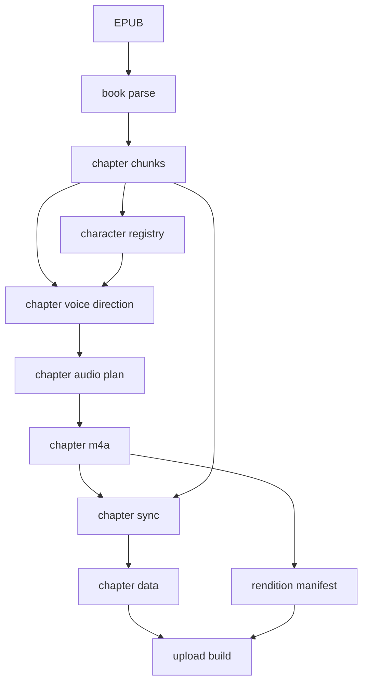

# Pipeline Resumable Repair Plan

## Purpose

Make the audiobook pipeline resumable, repairable, and parallelizable by turning
each major stage into a file-to-file contract. A stage should read explicit
artifacts, write explicit artifacts, and avoid knowing what came before or what
will happen next.

The guiding invariant stays the same as the current project spec:

- A rendition is the user-facing artistic identity.
- A build is an immutable output snapshot.
- Per-build URLs remain immutable.
- The book manifest is the mutable pointer to the current build.
- `chapter_data.json` remains the reader contract for text plus word sync.

This plan does not change the public worker/client contract first. It makes the
pipeline's internal artifacts strong enough that the public artifacts can be
assembled or repaired safely.

## Target Shape



## Core Artifacts

### `book_parse.json`

Book-level parse output:

- metadata
- chapter list
- spoken content elements
- cover/EPUB artifact references
- EPUB hash

This artifact is deterministic for a given EPUB and parser version.

### `chapter-NN.chunks.json`

Chapter-level chunk output:

- chapter number and title
- chunk index
- reader text
- source element range
- paragraph/chapter boundary metadata
- stable text hash per chunk

This is the canonical input for direction, synthesis, sync repair, and
`chapter_data.json` assembly.

### `character_registry.json`

Book/rendition cast registry:

- narrator voice
- known characters
- aliases
- selected voices
- registry source/provenance

For solo narration with an explicit voice, this can be built without an LLM
call. Multicast is a book-level generation mode; this repair plan does not
support converting an existing solo build into multicast or doing chapter-level
multicast repair that changes the book cast model.

### `chapter-NN.voice_direction.json`

Canonical chapter directive:

- chunk index
- original reader text
- directed segments
- speaker
- voice
- emotion/performance controls
- speed
- pause hints
- join policy
- source hashes

This should be the boundary between LLM work and audio work. Once this file
exists, audio regeneration should not require another LLM call.

> **Note (implemented):** an intermediate `chapter-NN.audio_plan.json` was
> considered as a separate engine-ready plan between direction and synthesis,
> but it was dropped — it had no second consumer. `synth` reads
> `chapter-NN.voice_direction.json` directly and builds engine input
> (`ChunkInfo`) in memory.

### `chapter-NN.m4a`

Chapter audio output. It is immutable inside a build. A repair that changes
audio should produce a new build or a new repaired chapter artifact set before
upload.

### `chapter-NN.sync.json`

Chapter-level sync output:

- chunk index
- words
- start/end timestamps
- alignment coverage metrics
- aligner version/config
- source audio hash
- source chunk hash

This is the repair target for WhisperX-only fixes.

### `chapter_data.json`

Assembled public reader contract:

- chapter text chunks
- inline word timestamps

This should become an assembly product from `chapter-NN.chunks.json` plus
`chapter-NN.sync.json`, not the only durable place where sync exists.

## Repair Modes

### Direction Repair

Input:

- `chapter-NN.chunks.json`
- `character_registry.json`
- engine capability config

Output:

- `chapter-NN.voice_direction.json`

Use when speaker attribution, emotion direction, speed, or pause hints need to
change. This is the only repair mode that may call the LLM.

### Audio Regeneration

Input:

- `chapter-NN.voice_direction.json`
- engine voice assets

Output:

- `chapter-NN.m4a`
- `chapter-NN.sync.json`

Implemented as the `synth` DAG command. Use when TTS engine behavior changes, a
directive was manually edited, or a chapter needs to be regenerated from known
direction.

### Pause/Stitch Policy Repair

Input:

- `chapter-NN.voice_direction.json`
- engine voice assets

Output:

- `chapter-NN.m4a`
- `chapter-NN.sync.json`

Use when pause policy, boundary fades, generated silence trimming, title breaks,
paragraph breaks, or chunk joins change. Because WAV/unit intermediates are not
durable build artifacts, this repair regenerates chapter audio from the existing
directive instead of restitching old persisted parts. It is the same `synth`
command as Audio Regeneration (no separate `restitch` verb). It avoids LLM but
does not avoid TTS.

### Sync Repair

Input:

- `chapter-NN.m4a`
- `chapter-NN.chunks.json`
- `chapter-NN.sync.json` (prior — for the per-chunk `chunk_audio_starts`, which
  are produced at synthesis time and not recoverable from the m4a alone)

Output:

- `chapter-NN.sync.json`
- reassembled `chapter_data.json`

Use when WhisperX alignment improves or a sync artifact has missing coverage.
This should avoid LLM and TTS.

### Assembly Repair

Input:

- all selected `chapter-NN.chunks.json`
- all selected `chapter-NN.sync.json`
- all selected chapter audio metadata

Output:

- `chapter_data.json`
- `rendition-manifest.json`
- book manifest update payload

Use when public artifacts need to be rebuilt from existing per-chapter outputs.

## Idempotency Rules

- Every stage computes an input fingerprint from its explicit input artifacts.
- If the output exists and records the same input fingerprint, the stage skips.
- If the output exists with a different fingerprint, the stage fails unless
  `--force` is provided.
- R2 upload keeps the current rule: if a completion marker exists for a build
  prefix, upload skips unless forced.
- Immutable build artifacts are not rewritten in place during normal repair.
  A repair produces a new build snapshot.

## Parallelization Rules

Safe to parallelize:

- chapter chunk validation
- solo chapter direction after registry is fixed
- audio generation from existing chapter directives
- AAC encoding
- WhisperX sync per chapter
- per-chapter upload of immutable objects

Not parallelizable without changing the spec:

- multicast registry discovery and book-level cast planning
- final book manifest pointer update
- any stage that writes only one aggregate artifact without per-chapter inputs

## Chapter-Level Direction Policy

`direct_chapter` should remain the production direction boundary.

The target behavior:

- chapter direction emits the full `chapter-NN.voice_direction.json`
- chunk-level fallback is allowed, but its output is still written into the same
  chapter directive schema
- audio generation consumes chapter directives only
- manual directive edits are supported by source hashes and validation

This makes retry/resume possible because the LLM output is no longer transient
state hidden inside the full-book runner.

## Sync Coverage Policy

Every sync artifact should include coverage metrics:

- reader word count
- aligned word count
- coverage ratio
- first missing word offset when detectable
- per-chunk coverage summary

These metrics are diagnostic only. Sync failure is a pipeline bug to detect and
fix, not a policy gate that should block upload or create a separate unhealthy
build state.

## Incremental Migration

1. Persist `chapter-NN.chunks.json` and teach `chapter_data.json` assembly to
   read it. ✅
2. Treat `chapter-NN.voice_direction.json` as the canonical input to audio
   generation. ✅
3. Add `chapter-NN.sync.json` and move sync repair to chapter-level artifacts. ✅
4. Add sync coverage diagnostics for development/debugging. ✅
5. Add repair commands for `direction`, `audio`, `sync`, and `assemble`. ✅

**Status: implemented.** The stage commands live in
`src/openshelf/pipeline/dag/cli.py` (`parse`, `chunk`, `direct`, `synth`,
`sync`, `assemble`, `coverage`, `upload`) — see `docs/dag-cli.md`. The
per-chapter logic is shared between the standalone commands and the full DAG
runner (one code path): `build_chunk_windows` and
`build_direction_chapter`/`build_voice_direction_payload` (direction),
`build_chunk_infos` + `synthesize_chapter_to_files` (audio), and
`build_chapter_data_payload` (assembly). `book_parse.json` was added as a
durable local parse artifact (`docs/step1b-book-parse.md`).

## CLI Shape

Implemented as `openshelf-pipeline dag <command>` (see
`docs/dag-cli.md` for full flags):

```bash
openshelf-pipeline dag parse   --epub book.epub --out book_parse.json --source gutenberg
openshelf-pipeline dag chunk   --book-parse book_parse.json --build-dir {build_dir}
openshelf-pipeline dag direct  --build-dir {build_dir} --chapter 2 --engine kokoro
openshelf-pipeline dag synth   --build-dir {build_dir} --chapter 2 --engine kokoro
openshelf-pipeline dag sync    --build-dir {build_dir} --chapter 2 --force
openshelf-pipeline dag assemble --build-dir {build_dir} --rendition {r} --build-id {b}
openshelf-pipeline dag upload  --book-dir {book_dir} --rendition {r} --build-id {b}
```

Each command should be runnable on one chapter, many chapters, or all chapters
where that makes sense.

## Design Decisions

- Repaired builds clone unchanged artifacts from the old build into a new build
  prefix. The book manifest then points to the new build as `current_build`.
  This avoids mutation semantics and lets the client automatically pick up the
  latest coherent snapshot.
- WAV/unit audio intermediates should not be kept as durable artifacts.
- Sync coverage should not block upload and should not define a separate build
  health policy. Missing or partial sync is a bug to fix or detect during
  development.
- Multicast is a book-level generation mode. We do not support converting an
  existing solo build into multicast, or chapter-level multicast repair/resume
  that changes the book cast model.
- Idempotency based on artifact fingerprints is enough. Engine-specific
  deterministic seeds are not required for the resumable workflow spec.
