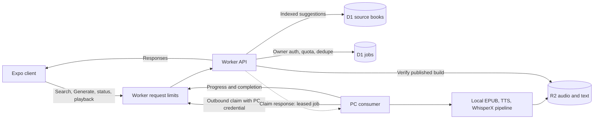

# Plan: book discovery and PC audio generation

**Status:** first Gutenberg/Kokoro vertical slice implemented, tested, and
validated in isolated staging with a real *The Tale of Peter Rabbit* GPU job.
Production D1, Worker bindings, credentials, and initial source index are
provisioned. Remaining work packages cover broader source and engine support.
This document also records the original design and cost assumptions. The
section-based version-2 playback contract remains the output of every job.

## Outcome

From the existing Expo client, an owner can type a title or author, choose a
specific downloadable Gutenberg or Standard Ebooks edition, request an
audiobook, watch its status, and open the resulting rendition when ready. A
process running on the owner's Windows PC takes jobs when online, performs the
existing Python pipeline, and publishes to R2. A stopped PC leaves jobs queued.

The first vertical slice uses Gutenberg, Kokoro with an explicit `af_heart`
voice, one concurrent job, and the existing root `.venv` with CUDA. Standard
Ebooks, other engines, and additional workers follow through the same contracts.
Normal catalog browsing and playback continue to use the existing R2 routes.

### Independent EPUB retrieval and audio failure visibility

Each indexed search result offers **Download EPUB** alongside its audio status.
This is a separate fast request: the Worker looks up the exact source ID,
validates its stored HTTPS Gutenberg EPUB URL (host, source ID, credentials,
port, query, and fragment), and redirects to Gutenberg's original EPUB.
It works with the PC offline and while any audio job is queued, running, failed,
or canceled; it neither queues GPU work nor consumes a generation start.
The original source EPUB is not an annotated audiobook artifact and is not
added to the audiobook catalog. Existing completed-book downloads continue to
use the annotated R2 EPUB route. Missing IDs, invalid stored URLs, and public
request limits return explicit errors, with no redirect on failure.

Search results include the latest job's public error code alongside its state.
Reopening search must preserve the specific word-budget or rights failure
message, without needing an active-job poll. Audio preflight retains its
100,000-word default; a larger owner-reviewed book uses an explicit CLI
`--max-words` override on its retry. Local consumer logs include the measured
word count and limit when rejecting an oversized book.

## Decisions and boundaries

- The PC **initiates outbound HTTPS polling**. No publicly reachable listener,
  port forwarding, or permanently running Cloudflare Worker is required. The
  process is a `books consume-jobs` CLI/service, even if the operator calls it a
  server.
- D1 holds the searchable source-book index and durable job records. R2 remains
  the source of truth for completed audiobook artifacts. D1's FTS5 support is
  documented at <https://developers.cloudflare.com/d1/sql-api/sql-statements/>.
  Use one database per environment, with migrations checked into `worker/`.
- An operator can import Gutenberg's weekly compressed CSV and rights-bearing
  RDF archive through the authenticated PC source-sync route. Import is capped to a
  chosen number of English `Text` records per run, in batches of at most 50,
  with a numeric-ID cursor for resuming. The importer takes the EPUB URL from
  the matching RDF record and validates its host and Gutenberg ID; catalog
  cells never supply URLs.
  It does not run during public requests or automatically start audio jobs.
  CSV rows are candidates, not proof of public-domain status. The PC streams
  the official RDF archive and syncs only candidates whose exact record says
  `Public domain in the USA.` and names a valid EPUB. Unknown or copyrighted
  records are omitted. No per-book network call is made during import.
  Check D1 daily row-write usage before repeating batches.
  If completed/failed job history grows enough to slow autocomplete, add an
  index on `(source_id, created_at DESC)` for the latest-job lookup; the
  two-starts-per-day cap keeps this a later scaling concern.
- Gutenberg IDs and Standard Ebooks edition paths are stable **source IDs**.
  The client submits an ID, never a URL, local path, shell argument, or arbitrary
  model setting. The consumer resolves a stored, allowlisted EPUB URL and
  verifies it is an EPUB before processing.
- Before synthesis, the PC rechecks the exact Gutenberg ID against Gutenberg's
  own per-book RDF and requires `Public domain in the USA.`. Missing, changed,
  or copyrighted rights fail closed. After downloading the EPUB, it separately
  requires the embedded OPF `dc:rights` to say the same and rejects an explicit
  copyrighted Project Gutenberg notice in readable front matter. This protects
  jobs already in D1 from the earlier index sync that did not screen copyright.
- The rights gate applies to the automatic Gutenberg import and PC job path.
  Manual CLI uploads remain operator-controlled. Public reading is not
  geographically restricted; the operator is responsible for distribution
  rights beyond the U.S. marker used by the automatic path. A rights-failed
  job may be retried by the owner, but every attempt repeats the PC preflight.
- Public visitors may request the fixed Kokoro `af_heart` narration without a
  credential. Worker rate limiting runs before D1 for creation and status reads,
  and atomic D1 daily-start,
  queue, and active-source caps remain authoritative. Owner operations such as
  canceling, retrying, and regeneration require the local owner token or a
  Google-signed ID token for verified `johnkoeh@gmail.com`. Paid model
  direction is a separate owner-only job mode; a separate PC secret authorizes claim, progress,
  completion, and source-index writes. Neither PC nor owner secrets are bundled
  in the app. Listening and searching remain public.
- One active job per `source_id` is enforced in D1 across modes. Duplicate
  requests return the existing job. An already published edition opens its
  audiobook unless the owner explicitly requests regeneration. Retrying a
  failed job retains its build ID and resumes; explicit regeneration after
  completion creates a fresh build.
- A claimed job has a short renewable lease. A worker that loses its lease stops
  its child pipeline process. Expired leases are reclaimable. All progress and
  completion writes require the current lease token. The same immutable
  `build_id` is reused after a crash, with `--resume` and the existing `run.json`
  input check. A job is complete only after the rendition manifest, section
  artifacts, book pointer, and catalog are published and readable.
- Cancel is terminal for a queued or running job. It revokes the current lease;
  a running PC checks in every 30 seconds and stops its child process after a
  rejected heartbeat. Daily start reservations remain spent. Cancel does not
  delete already published R2 artifacts or guarantee interruption of an upload
  already in progress.
- Source metadata and audiobook catalog entries join on `source_id`. Add an
  optional source ID to newly generated book manifests/catalog rows while
  preserving compatibility with existing R2 objects and local EPUB workflows.
  Existing books without an ID need a reviewed one-time backfill; do not guess
  an edition from title/author alone.

## Cost controls

Budget for Cloudflare Workers Paid ($5/month as of September 2026) if indexing
the full Gutenberg catalog at once. Workers Free has 100,000 requests/day; D1
Free has 5 million rows read/day and 100,000 rows written/day. Free Worker
invocations also have a 10 ms CPU limit, so bounded suggestion ranking matters.
An unindexed autocomplete query or job-claim scan can exhaust the D1 read
allowance even with modest traffic. Use indexed lookup, a small result limit,
and a 300 ms client debounce; inspect D1's actual `rows_read`/`rows_written`
metrics after seeding. Run the initial import in bounded batches. See
<https://developers.cloudflare.com/workers/platform/pricing/> and
<https://developers.cloudflare.com/d1/platform/pricing/>.

An idle PC polls every 30–60 seconds with increasing backoff on errors. Thirty
seconds costs 2,880 Worker requests/day. Heartbeats happen only for a running
job. Owner authorization, one active job per edition, one local
generation at a time, and a retry cap bound accidental GPU/API work.

Use R2 **Standard** for audio. It includes 10 GB-month of storage and free
egress; additional storage is $0.015/GB-month at current rates. At the pipeline's
48 kbps AAC setting, an eight-hour audiobook is about 173 MB of audio before
metadata and retained builds. Track total retained builds, since regenerating
the same title adds storage. See <https://developers.cloudflare.com/r2/pricing/>.

Kokoro TTS and WhisperX run on the PC. The explicit voice in the first slice
bypasses the registry LLM call, and Kokoro does not use performance-direction
LLM calls; this path can avoid per-book model API fees. Automatic narrator
selection and other engines may call the configured paid provider. Log model
token usage and the PC's measured generation time before estimating their
per-book cost. Electricity is `average PC kW × runtime hours × local $/kWh`.
Expressive jobs fix the Chatterbox narrator, run batched OpenAI performance
direction on the PC, and share the same daily start cap; neither public traffic
nor a job payload can choose an arbitrary model or prompt. A consumer without
the local OpenAI key leaves those jobs queued.

## Bot and abuse controls

The Worker exposes capped public fixed-voice generation requests and status,
with owner-only administration alongside public reads. Its autocomplete is
rate-limited before D1 access. The following controls
are the current baseline and near-term hardening rules:

1. **Public search:** use a Worker rate-limiting binding keyed by route and
   client IP, initially returning HTTP 429 after about 60 autocomplete requests
   per minute per IP. Require 2–80 query characters, cap suggestions at 10,
   use indexed D1 search, and keep up to 128 successful suggestion responses
   for 15 seconds per Worker instance by origin, normalized query, and limit, after
   rate limiting. Instances do not share memory, so this is a best-effort D1
   optimization on the production `workers.dev` hostname. Return `no-store`
   to clients; availability may lag by 15 seconds. Make
   audio/range routes a separate, more generous category so normal playback
   is not throttled. Adjust thresholds from measured traffic.
2. **Job creation:** allow unauthenticated fixed-voice requests through a
   dedicated, per-IP Worker limit before D1. Require owner authentication for
   regeneration, retry, cancellation, and paid direction; reject invalid
   credentials before a job write. Store owner credentials as Worker secrets,
   never in the public client bundle or logs. Apply a separate rate limit to
   authentication failures. Enforce, with atomic
   D1 writes, one active job per source, at most three queued jobs,
   an initial owner budget of two generation starts per day including retries,
   and at most three attempts per job. Return the existing job for duplicate
   requests. Only accept known source IDs and allowed engine/voice choices.
   The D1 quota is the authoritative GPU cost cap. Canceled reservations stay
   spent so an owner cannot cancel and create repeatedly to exceed that cap.
3. **PC access:** require a distinct, revocable consumer credential for claim,
   heartbeat, progress, source sync, and finish. Keep it only on the PC.
   Require a valid lease token for job updates. No inbound PC port is exposed.
4. **Edge defense:** the Worker limiter protects D1, but rejected requests still
   invoke the Worker. If the API moves from its current `workers.dev` address to
   a Cloudflare custom domain, add a zone WAF rate-limiting rule to reject floods
   before Worker invocation. Return 429/block for JSON API traffic; an
   interactive challenge can break native clients and the PC consumer. The
   Worker rate-limiting binding is per Cloudflare location and eventually
   consistent, so never use it as the only quota. See
   <https://developers.cloudflare.com/workers/runtime-apis/bindings/rate-limit/>
   and <https://developers.cloudflare.com/waf/rate-limiting-rules/>.

CORS, hiding the Generate button, and client-side debounce do not authorize
requests. Turnstile is optional if generation later opens beyond the owner;
its token must be verified by the Worker via Siteverify, and it does not
replace authentication or job quotas. See
<https://developers.cloudflare.com/turnstile/get-started/server-side-validation/>.

## Proposed contracts to freeze before coding

### Source index

`source_books` stores `source_id`, `source`, canonical edition/page URL, EPUB URL,
title, authors, language, EPUB availability, `updated_at`, and optional published
`author_slug`/`title_slug`. Ingestion upserts metadata from Gutendex and Standard
Ebooks. Only entries with a known downloadable EPUB appear in search. Record the
last successful source refresh so an operator can see when the index is stale.

For the first Gutenberg rollout, the PC may sync Gutendex pages or import the
official weekly CSV. The CSV path is deliberately operator-run and capped at
1,000 records per invocation, with a 500-record default to keep a first run
well below D1 Free's daily write limit even with token-index maintenance. Runs
resume with `--after-id`; they upsert records and can be repeated. The Worker
first looks up the longest typed token's full prefix when the user typed at least three
characters, then tries indexed adjacent-transposition candidates for common
typos, then uses a bounded two-character sample as a final fallback. Each
lookup uses the token index and scans at most 80 candidates.

`GET /api/v1/source-books?q=&limit=` returns ranked suggestions with source ID,
title, author, and one of `ready_to_generate`, `queued`, `running`, `failed`, or
`available`, derived from jobs and published audiobook metadata. A canceled
latest job maps back to `ready_to_generate`.
An available result carries the existing book route slugs. Query
length is bounded; queries shorter than two characters return no suggestions.
Ranking favors exact title, title prefix, author prefix, then word matches.
For queries of at least three characters, a bounded candidate set gets typo
scoring so `alcie` can suggest *Alice*. Debounce client requests and discard
stale responses; do not invoke a model for each keystroke. Preserve
`GET /catalog` as the generated-audiobook browse endpoint.

### Jobs and authorization

`generation_jobs` stores a random job ID, source ID, fresh 16-hex build ID,
state, stage, timestamps, attempt count, lease token and expiry, concise error
code, and eventual book slugs. The first path fixes engine/voice/rendition to
Kokoro `af_heart` on the PC. The owner-only `expressive` mode fixes Chatterbox
`af_heart`, batched OpenAI emotion direction, and its own rendition. Store the
mode immutably with each job so retry and lease recovery cannot switch costs or
outputs. The PC advertises expressive claim capability only with a local
OpenAI key; the Worker and client never receive that key. Keep the database
constraint for at most one active job per source across both modes. Both share
the two-start UTC daily cap, three queued jobs, and three attempts per job.
The owner PC monitor may mark a queued job high or normal priority. Claim orders
queued jobs by priority then creation time; running jobs are not preempted.
Priority never changes the daily-start reservation or queue/attempt caps.

All new HTTP shapes must be defined in Zod route schemas so
`/api/v1/openapi.json` is the contract:

| Method and route | Caller | Behavior |
| --- | --- | --- |
| `GET /api/v1/source-books` | Public | Ranked downloadable-book suggestions and current availability. |
| `POST /api/v1/generation-jobs` | Public standard; owner for regeneration/expressive | Create or return the active job for a source ID and fixed `standard` or `expressive` mode; require an explicit `regenerate` flag for an available book. |
| `GET /api/v1/generation-jobs/:id` | Public | Current state, stage, safe error category, and completed book link; no internal build ID or lease details. |
| `POST /api/v1/generation-jobs/:id/retry` | Owner | Requeue a failed job with the same build ID. |
| `POST /api/v1/generation-jobs/:id/cancel` | Owner | Set queued/running job to canceled, revoke its lease, and retain its daily start reservation. |
| `GET /api/v1/admin/generation-jobs` | Owner | Bounded active queue and 20 recent terminal jobs with title/author, priority, attempts, stage, and lease expiry; no secrets or internal build ID. |
| `POST /api/v1/admin/generation-jobs/:id/priority` | Owner | Set a queued job to normal or high priority without preempting running work. |
| `POST /api/v1/internal/generation-jobs/claim` | PC | Advertise local expressive capability; atomically lease one eligible queued/expired job, or return no work. |
| `POST /api/v1/internal/generation-jobs/:id/heartbeat` | PC | Renew a matching lease. |
| `POST /api/v1/internal/generation-jobs/:id/progress` | PC | Update stage/counts under a matching lease. |
| `POST /api/v1/internal/generation-jobs/:id/finish` | PC | Mark success or failure under a matching lease; verify R2 before success. |
| `POST /api/v1/internal/source-books/sync` | PC | Upsert validated source metadata in bounded batches. |

Terminal states are `completed`, `failed`, and `canceled`; `queued` and `running` are active.
Within `running`, stage values such as `download`, `parse`, `direction`,
`synthesis`, `alignment`, `encode`, and `upload` are informational. Do not
fabricate a percent or section count. Use an atomic D1 claim statement and a
lease-token compare on every subsequent mutation. Rate limit public creation;
authorize owner and PC mutations, bound request sizes, and use
`Cache-Control: no-store` for job responses.

### PC process and publication

The consumer starts with a Windows command using the **root** `.venv`, checks
GPU/ffmpeg/R2 and its Worker credentials, and defaults to one simultaneous job.
It polls with backoff when idle, handles Ctrl-C by stopping the child cleanly,
and resumes any reclaimed job under its original build ID. It downloads the
exact indexed edition once, records its hash, then calls an exact-book pipeline
entry point rather than the existing broad `--author`/`--book` search, which can
process multiple matches. Keep the source identity through local artifacts,
book manifest, and catalog generation. Add structured stage/section events at
the pipeline boundary so progress does not rely on parsing human log text.

Before expensive work on a reclaimed job, inspect R2 for a fully published
matching build. If it exists, reconcile the job to `completed`. On success,
verify the final manifest points to the job's build and its expected section
objects exist. If validation fails, leave the job failed with a useful error.

## Work packages and order

The integrator owns the contract, shared files, and final checks. After package
0 freezes the schemas and file ownership, packages 1, 2, and 3 can run in
parallel in separate worktrees. Package 4 consumes their interfaces. Merge and
run the end-to-end gate only after the independent tests pass.

| Package | Owner / primary files | Deliverable | Depends on |
| --- | --- | --- | --- |
| **0. Contracts and docs** | Integrator: root `AGENTS.md` flow, `worker/CLAUDE.md`, `worker/docs/openapi.md`, `client/CLAUDE.md`, `pipeline/AGENTS.md` and affected step docs; shared Worker D1/rate-limit bindings, route mount, and CLI registration | Confirm source IDs, job states, API schemas, R2 metadata, CLI/event shape, and route-specific abuse budgets. Reconcile the known stale chapter references in `worker/CLAUDE.md` and `client/CLAUDE.md` before touching those components. Reserve distinct D1 migration numbers for packages 1 and 2. | None |
| **1. Source discovery** | Search agent: `pipeline/src/openshelf/scrapers/`, a dedicated source-index module; a distinct `worker/` D1 migration and search route/tests | Exact source IDs, initial import/refresh, ranked bounded suggestions, search 429s, reviewed existing-book link. Gutenberg first, then Standard Ebooks. | 0 |
| **2. Job control** | Worker agent: separate job routes, auth/lease helpers, distinct D1 migration/tests | Capped public fixed-voice creation/status, owner cancel/retry/regeneration, and PC claim/heartbeat/progress/finish with atomic deduplication, daily/pending quotas, failed-auth throttling, and lease expiration. | 0 |
| **3. PC runner** | Pipeline agent: dedicated consumer and exact-book process modules, CLI/docs/tests | Preflight, exact EPUB acquisition, structured events, lease renewal, resume and publish verification. Use a stub Worker API while package 2 is in flight. | 0 |
| **4. Client** | Client agent: `client/app/`, `components/`, `lib/api.ts`, `types.ts`, tests | Autocomplete, exact edition selection, public fixed-voice request and status, and book opening without token entry. | 1, 2 |
| **5. Integration and operations** | Integrator: shared contracts, README/Windows setup, staging bindings/secrets, smoke scripts | One real queued book proceeds through PC generation to playable section sync; deployment and recovery instructions. | 1–4 |

The integrator wires shared `worker/src/index.ts`, `worker/src/types.ts`,
`worker/wrangler.toml`, and `pipeline/src/openshelf/pipeline/books.py` after the
parallel packages land; parallel agents should not edit those files. Each
package follows the repo's docs-first rule: spot-check current docs against
current code, update the relevant spec first, then implement. A newly found
doc/code conflict is surfaced for a decision before that region is edited.
Keep route shapes in Zod; do not hand-maintain an OpenAPI copy.

## Acceptance gates

1. Source index contains a selectable Gutenberg edition without audio. Search
   suggests it for title, author, prefix, and a common typo. Already published
   books offer Open, and a queued/running book shows its job. Repeated public
   search requests receive 429 before an expensive D1 query.
2. Two simultaneous requests for the same source, even in different modes, create one active
   job. A client cannot submit an arbitrary EPUB URL, engine, or voice. Requests
   without owner credentials can start a fixed-voice job but cannot retry,
   cancel, regenerate, or select paid direction. A flood of create and retry
   requests cannot exceed the D1-enforced daily and pending-job caps;
   expired or revoked credentials fail closed.
3. With the PC stopped, the job stays queued. Starting the consumer claims it
   without inbound network configuration. A second consumer cannot claim it
   while the lease is healthy.
4. Kill the consumer during generation. After lease expiry, restart it and
   resume the **same** build. Repeated progress/finish calls and a lost network
   response do not create a second build or mark an incomplete build successful.
5. When the job completes, the catalog and book routes expose its rendition and
   build, section audio streams, and word highlighting works in the reader.
   An upload or alignment failure appears as a recoverable failed job.
6. Run `npm run typecheck`, `npm test`, Python offline tests, GPU preflight in the
   root `.venv`, and a staging end-to-end smoke test. Verify generated OpenAPI
   paths and local/production D1 migrations. Do not claim real synthesis is
   verified from mocked tests alone.

## Release sequence

Deploy additive D1 schema and read-only search first; seed and inspect its
index. Next deploy the job routes, then run the PC consumer in
staging with one small book. Enable the client Request control after the
staging acceptance gates pass. Existing `/catalog`, book, section, and audio
routes stay compatible throughout. Keep the old client usable if generation is
disabled; failed jobs remain inspectable and retryable.

The initial live release limited creation to the owner and Kokoro. The public
showcase path retains Kokoro and fixed voice under the same global caps. Add
Standard Ebooks ingestion and additional engine/voice options only after
exact-source handling and resume behavior are demonstrated in staging.
